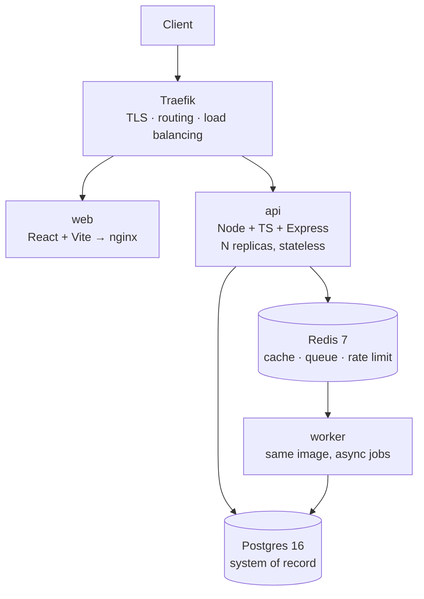

# <PROJECT NAME>

> **Live:** <https://REPLACE_ME>  ·  **CI:** 

<One sentence: what this is and who it is for.>

Built for **Zero to Production — Phase 2**, IEEE Computer Society CUET Student Branch Chapter, 8 August 2026.

---

## Contents
1. [Architecture](#architecture) · 2. [Tech choices](#tech-choices-and-why) · 3. [Quick start](#quick-start) · 4. [Configuration](#configuration) · 5. [API reference](#api-reference) · 6. [Testing](#testing) · 7. [Deployment](#deployment) · 8. [Demo credentials](#demo-credentials) · 9. [Known limitations](#known-limitations) · 10. [Acknowledgements](#acknowledgements)

---

## Architecture



**Why these boundaries.** We split on **failure and scaling profiles**, not on domain nouns:

| Service | Responsibility | Scaling profile |
|---|---|---|
| `api` | Synchronous request handling. Stateless — no in-process session or counter state | Horizontal, behind Traefik |
| `worker` | Asynchronous work the user never waits for. **Same image as `api`**, different entrypoint | Independent of request traffic |
| `web` | Static React build served by nginx. No Node runtime in production | Trivially cacheable |
| `postgres` | System of record | Vertical; read replicas first |
| `redis` | Cache, job queue, and shared rate-limit counters | Vertical |

`api` and `worker` share one image, one dependency tree and one test suite — so the split costs almost nothing in build complexity while buying real operational separation.

## Tech choices (and why)

| Choice | Reason | Rejected alternative |
|---|---|---|
| **TypeScript + Express** | Types make the API contract explicit; `zod` gives runtime validation from the same shapes | Plain JS — no contract enforcement at the boundary |
| **Postgres** | <Relational data, needs transactions/constraints> | <MongoDB — we would have to enforce these in app code> |
| **Redis** | Cache + queue + rate limiting in one dependency | In-memory — breaks the moment `api` has more than one replica |
| **Traefik** | Auto-discovers containers by label; load balances with zero config files | Hand-written nginx — more config to maintain and get wrong |
| **Raw SQL migrations** | Reviewable files in git, run as an explicit deploy step | ORM `synchronize: true` — silently rewrites production schema on boot |
| **Docker Compose** | Whole stack up in one command; matches the deployment target | Kubernetes — real operational cost, no benefit at this scale |

---

## Quick start

**Prerequisites:** Docker and Docker Compose. Nothing else.

```bash
git clone https://github.com/<user>/<repo>.git
cd <repo>
cp .env.example .env          # then edit the secrets

docker compose up -d --build  # brings up the ENTIRE stack
docker compose run --rm migrate
docker compose run --rm seed  # demo data

curl http://localhost:8080/health
open http://localhost:8080
```

**Local development** (hot reload, infrastructure in Docker):

```bash
docker compose up -d postgres redis
cd services/api && npm install && npm run dev
cd web && npm install && npm run dev     # http://localhost:5173
```

---

## Configuration

Every environment-specific value is an environment variable. **No secrets are committed**; `.env` is gitignored and `.env.example` documents every key. The app validates its config at boot (`src/config/env.ts`) and refuses to start on bad input rather than failing later at request time.

| Variable | Purpose | Default |
|---|---|---|
| `HTTP_PORT` | Host port for Traefik | `8080` |
| `DATABASE_URL` | Postgres connection string | — |
| `REDIS_URL` | Redis connection string | — |
| `JWT_SECRET` | Token signing key, min 32 chars | — |
| `CORS_ORIGINS` | Comma-separated allowlist (never `*`) | `http://localhost:5173` |
| `RATE_LIMIT_MAX` | Requests per window per identity | `100` |
| `LOG_LEVEL` | pino level | `info` |

---

## API reference

Base URL: `/api/v1` · All responses JSON · All errors share one shape.

**Error format** — every error carries a `requestId` that matches the `X-Request-Id` response header and every server log line for that request:

```json
{ "error": { "code": "VALIDATION_ERROR", "message": "Request validation failed",
             "requestId": "…", "details": [{ "field": "title", "message": "Title is required" }] } }
```

| Status | Meaning |
|---|---|
| `200` / `201` / `204` | Success |
| `400` | Malformed request |
| `404` | Resource does not exist |
| `409` | Business-rule violation (e.g. an invalid state transition) |
| `422` | Validation failed — `details` lists the offending fields |
| `429` | Rate limited — see the `Retry-After` header |
| `500` | Unexpected server error (details logged, never returned) |

### Endpoints

| Method | Path | Description |
|---|---|---|
| `GET` | `/health` | Liveness. Checks nothing external. Returns the serving `instance` |
| `GET` | `/ready` | Readiness. Pings Postgres and Redis; `503` if either is down |
| `GET` | `/metrics` | Prometheus exposition format |
| `GET` | `/api/v1/items` | List. `?limit=` (max 100) `&cursor=` `&status=` — **cursor paginated** |
| `POST` | `/api/v1/items` | Create → `201` |
| `GET` | `/api/v1/items/:id` | Fetch one |
| `PATCH` | `/api/v1/items/:id` | Update. Status changes go through the state machine |
| `DELETE` | `/api/v1/items/:id` | Delete → `204` |

<!-- Replace `items` with the real resources. Keep the table. -->

---

## Testing

```bash
cd services/api
npm test              # unit tests
npm run test:watch
npm run lint && npm run typecheck
```

**Strategy: test the business rules, not the framework.** Core domain logic lives in pure functions (`*.rules.ts`) that import no database, no HTTP and no config — so their tests need no containers, no mocks and no fixtures, and they fail for exactly one reason: someone changed a domain rule.

CI runs lint → typecheck → migrations → tests against real Postgres and Redis service containers, then builds both images and boots the full stack to smoke-test `/health` through the proxy.

---

## Deployment

Deployed to **<TARGET>** at <URL>.

```bash
# On the server
git clone https://github.com/<user>/<repo>.git && cd <repo>
cp .env.example .env && $EDITOR .env      # real secrets

docker compose up -d --build
docker compose run --rm migrate
docker compose run --rm seed
curl -f http://localhost:${HTTP_PORT}/health
```

**Horizontal scaling.** The API is stateless, so replicas need no coordination:

```bash
docker compose up -d --scale api=3
for i in $(seq 1 10); do curl -s localhost:8080/health | jq -r .instance; done
# → the instance id rotates: Traefik is round-robining
```

### Production readiness

- Multi-stage builds, pinned base images, non-root user, `.dockerignore`
- Healthchecks on every service; Traefik pulls unhealthy replicas out of rotation
- Graceful shutdown on `SIGTERM` — in-flight requests drain before exit
- Structured JSON logs with a request id correlated across services
- Redis-backed rate limiting (**shared across replicas**, unlike in-process counters)
- `helmet` security headers, CORS allowlist, 100 KB body cap, parameterised SQL
- Cursor pagination on every list endpoint — no unbounded queries
- Prometheus metrics at `/metrics`
- Postgres in a named volume, on an internal network with no host exposure in production

---

## Demo credentials

| Role | Email | Password |
|---|---|---|
| <Admin> | `<demo@example.com>` | `<password>` |
| <User> | `<user@example.com>` | `<password>` |

---

## Known limitations

*Honest list. <!-- Fill this in truthfully — the organisers explicitly reward this over a misrepresented system. -->*

- **Job queue is at-most-once.** A job popped by a worker that then crashes is lost. At-least-once needs `BRPOPLPUSH` onto a processing list plus an ack.
- **Rate limiting uses a fixed window**, which permits a 2× burst across a window boundary. A sliding-window log fixes it at the cost of memory.
- **Migrations are forward-only.** No down migrations, so a rollback means restoring from backup.
- **No distributed tracing.** Structured logs and metrics exist; there is no OpenTelemetry span propagation, so cross-service latency attribution is manual.
- **No automated backups.** `pg_dump` on a schedule is the next step.
- <Add whatever you actually cut.>

### What we would do next
1. <…>
2. <…>

---

## Acknowledgements

*Every external library, API, dataset and service used — this is a rule, not a courtesy.*

**Runtime:** Express · zod · pg · ioredis · pino · helmet · cors · prom-client · React · Vite
**Infrastructure:** Docker · Docker Compose · Traefik · PostgreSQL · Redis · nginx · GitHub Actions
**External APIs / datasets:** <list, or "none">
**AI assistance:** Development was AI-assisted, as permitted under §6.3 of the rulebook. Project scaffolding (Dockerfiles, CI workflow, proxy configuration, logging and error-handling setup) was prepared in advance as permitted under §6.2 and forms the first commit; everything problem-specific was built during the event. All architectural decisions are our own and every team member can explain the system.

## Team

| Name | Role |
|---|---|
| <name> | <backend / infra / deployment> |
| <name> | <frontend> |
| <name> | <docs / demo> |
