# CinemaSeat

> A cinema ticketing system that stays usable under a premiere rush and **never sells the same seat twice.**

**Live:** `http://<DEPLOY_HOST>` · **Health:** `http://<DEPLOY_HOST>/health`

Built for **Zero to Production — Phase 2**, IEEE Computer Society CUET Student Branch Chapter, in partnership with Poridhi.io.

---

## Contents

[What works](#what-works) · [Architecture](#architecture) · [How it never double-books](#how-it-never-double-books) · [Run it](#run-it) · [Judge's quick reference](#judges-quick-reference) · [API](#api) · [Testing the gateway's misbehaviour](#testing-the-gateways-misbehaviour) · [Proof](#proof-milestone-4) · [CI/CD](#cicd) · [Deployment](#deployment) · [What does not work](#what-does-not-work) · [Acknowledgements](#acknowledgements)

---

## What works

| | |
|---|---|
| Browse movies, showtimes, theatres | ✅ |
| Live seat map per showtime | ✅ |
| Hold seats, verify phone by OTP, pay, confirm | ✅ |
| Automatic release of unpaid holds | ✅ |
| **Zero oversell under 100 concurrent buyers for one seat** | ✅ verified, see [Proof](#proof-milestone-4) |
| Duplicate gateway callbacks handled idempotently | ✅ |
| Callback arriving *before* `/charge` returns | ✅ |
| Payment failure releases seats | ✅ |
| Works with the gateway container **stopped** | ✅ bonus |
| Circuit breaker on the gateway | ✅ bonus |
| Prometheus metrics, structured logs with request IDs | ✅ bonus |
| Nginx + Traefik reverse proxy, horizontally scalable API | ✅ bonus |
| Rate limiting, input validation on every entry point | ✅ bonus |
| AWS EC2 deployment with CI-gated CD | ✅ bonus |

---

## Architecture

```mermaid
graph TD
    U[Browser] --> T["Traefik<br/>edge routing + load balancing"]
    T --> W["web<br/>React → static → nginx"]
    T --> A["api<br/>Node + TS + Express<br/>stateless, N replicas"]
    A --> P[("Postgres 16<br/>single arbiter of seat state")]
    A --> R[("Redis 7<br/>cache + rate limit")]
    A -.->|"charge / otp"| G["gateway<br/>(provided, misbehaves on purpose)"]
    G -.->|"callback, 2-15s later"| A
    K["worker<br/>same image as api"] --> P
    K --> R

    classDef ext fill:#3a2e1c,stroke:#6b4a22;
    class G ext;
```



**Three services we wrote** (`api`, `worker`, `web`), plus Traefik, Postgres, Redis, and the provided gateway. One `docker compose up`.

### Why these boundaries

We split on **failure and scaling profiles**, not on domain nouns.

| Service | Why it is separate |
|---|---|
| `api` | Stateless and latency-sensitive. All seat contention resolves in Postgres, so replicas need no coordination with each other and scale horizontally behind Traefik. |
| `worker` | Runs the expiry sweeper and payment reconciliation. Throughput-sensitive, tolerant of being slow, and its failures must never touch the request path. **Shares the API's image** — one build, one test suite, two scaling profiles. |
| `web` | Static build served by nginx. No Node runtime in production. |

We did **not** split further. A service per domain noun (booking / payment / catalog) would have bought us distributed transactions across a boundary that has to be atomic — seats and bookings must move together — in exchange for nothing at this scale. See [DECISIONS.md](DECISIONS.md).

---

## How it never double-books

This is the heart of the system, so it is worth stating precisely.

**`show_seats` is the single serialization point.** One row per `(showtime_id, seat_id)`, composite primary key. Every seat-state change is a **guarded UPDATE** whose `WHERE` clause *is* the state machine:

```sql
-- 1. Lock the contended rows, always in the same order.
--    Deterministic ordering is what stops two overlapping multi-seat
--    requests from deadlocking against each other.
SELECT seat_id, price_cents, status, hold_expires_at, booking_id
  FROM show_seats
 WHERE showtime_id = $1 AND seat_id = ANY($2::uuid[])
 ORDER BY seat_id
   FOR UPDATE;

-- 2. The guarded transition. A seat is claimable only if it is free, or
--    held by someone whose time ran out.
UPDATE show_seats
   SET status = 'HELD', booking_id = $3,
       hold_expires_at = now() + make_interval(secs => $4)
 WHERE showtime_id = $1
   AND seat_id = ANY($2::uuid[])
   AND (status = 'AVAILABLE'
        OR (status = 'HELD' AND hold_expires_at < now()))
 RETURNING seat_id;

-- 3. rowcount is the verdict. Fewer rows than seats requested means
--    somebody else won at least one of them -> ROLLBACK, respond 409.
```

Three properties follow:

1. **Exactly one winner.** Concurrent transactions queue on the row lock. When a loser's turn comes, the row it wanted no longer satisfies the `WHERE`, so it updates zero rows and gets a clean `409`. Overselling is not unlikely here; it is unrepresentable.
2. **All-or-nothing.** A multi-seat request that cannot claim every seat rolls back entirely. No partial holds.
3. **Expiry does not depend on the worker.** The `OR (status='HELD' AND hold_expires_at < now())` clause means a timed-out hold is claimable *the instant it expires*. The background sweeper only refreshes the seat map for onlookers. **Stop the worker container and holds still expire correctly.**

The database also enforces what the code promises:

```sql
CONSTRAINT held_seats_have_a_booking
  CHECK (status = 'AVAILABLE' OR booking_id IS NOT NULL)

-- at most one live payment per booking, structurally
CREATE UNIQUE INDEX one_live_payment_per_booking ON payments (booking_id)
  WHERE status IN ('INITIATED','PENDING','SUCCEEDED');
```

### Duplicate callbacks

`payment_events.event_id` is a **primary key**, and every callback starts with:

```sql
INSERT INTO payment_events (event_id, ...) VALUES ($1, ...)
ON CONFLICT (event_id) DO NOTHING RETURNING event_id;
```

No row returned means we have seen it — we answer `200` and do nothing else. Because this is a constraint rather than a `SELECT`-then-`INSERT`, two API replicas can receive the same duplicate simultaneously and exactly one will apply it.

Every state/status pair has a defined action (`services/api/src/modules/payment/payment.rules.ts`):

| Payment is | Callback says | We do | Why |
|---|---|---|---|
| `PENDING` | `SUCCEEDED` | **CONFIRM** | the normal path |
| `SUCCEEDED` | `SUCCEEDED` | **IGNORE** | duplicate; no second confirm, no double revenue |
| `SUCCEEDED` | `FAILED` | **IGNORE** | a late failure must never revoke a paid ticket |
| `PENDING` | `FAILED` | **FAIL** | release the seats |
| `FAILED` | `SUCCEEDED` | **REFUND** | we already released those seats; someone else may hold them now, so confirming would oversell. Refund instead. |

**We always answer `200`**, including for duplicates and unparseable bodies — a non-200 tells the gateway delivery failed and it retries up to 8 times, so a parse error would turn one bad message into a flood.

---

## Run it

**Prerequisites: Docker. Nothing else.** No `.env`, no manual steps.

```bash
git clone <repo-url> && cd cinemaseat
docker compose up
```

That is the whole thing. Migrations and demo seed data run automatically as part of `up`; every configuration value has a working default.

- App: <http://localhost:8080>
- Health: <http://localhost:8080/health>
- Metrics: <http://localhost:8080/metrics>
- Gateway: <http://localhost:9000/health>

Cold boot from a wiped state takes about **85 seconds**, most of it image build.

### Watching a hold expire

```bash
HOLD_TTL_SECONDS=10 docker compose up -d
python loadtest/scenario-b.py
```

`HOLD_TTL_SECONDS` is read from the environment and has no hardcoded fallback anywhere in the business logic.

### Local development with hot reload

```bash
docker compose up -d postgres redis gateway
cd services/api && npm install && npm run dev
cd web && npm install && npm run dev     # http://localhost:5173
```

---

## Judge's quick reference

The two requests the problem statement asks us to document exactly.

### Fetch a seat map

```bash
curl -s http://localhost:8080/api/v1/showtimes/{SHOWTIME_ID}/seats
```

```jsonc
{
  "showtime": {
    "id": "2e1a2fcd-…", "movie_title": "Spider-Man: Brand New Day",
    "hall_name": "Hall 1", "theatre_name": "Star Cineplex",
    "starts_at": "2026-08-08T08:00:00.000Z", "rows": 8, "cols": 12
  },
  "seats": [
    { "seat_id": "5fe5305b-…", "row": "F", "col": 12, "label": "F12",
      "status": "available", "price_cents": 45000 }
  ],
  "summary": { "available": 96, "held": 0, "booked": 0 }
}
```

`status` is one of `available` | `held` | `booked`. A hold past its deadline reports as `available` even before the sweeper runs.

### Hold a seat

```bash
curl -s -X POST http://localhost:8080/api/v1/holds \
  -H 'Content-Type: application/json' \
  -d '{
        "showtime_id": "2e1a2fcd-…",
        "seat_ids": ["5fe5305b-…"],
        "phone": "+8801700000000"
      }'
```

**`201 Created`**

```jsonc
{
  "booking_ref": "bk_232f3fdc80c1",
  "showtime_id": "2e1a2fcd-…",
  "status": "HELD",
  "seats": [{ "seat_id": "5fe5305b-…", "label": "F12", "price_cents": 45000 }],
  "amount_cents": 45000,
  "expires_at": "2026-08-08T05:12:34.567Z",
  "hold_ttl_seconds": 120
}
```

**`409 Conflict`** — somebody else got there first:

```jsonc
{
  "error": {
    "code": "CONFLICT",
    "message": "One or more seats are no longer available",
    "requestId": "9131b99a-…",
    "details": { "unavailable_seats": [{ "seat_id": "…", "label": "F12", "status": "HELD" }] }
  }
}
```

### Get the IDs to use

```bash
curl -s http://localhost:8080/api/v1/movies \
  | python3 -c "import sys,json;d=json.load(sys.stdin)['data'][0];print(d['title'],d['showtimes'][0]['id'])"
```

---

## API

Base `/api/v1`. Every error shares one shape and carries a `requestId` that matches the `X-Request-Id` header and every server log line for that request.

| Method | Path | Notes |
|---|---|---|
| `GET` | `/health` | Liveness. Checks nothing external, so it stays green with the gateway down. Reports the commit it was built from. |
| `GET` | `/ready` | Readiness. Pings Postgres and Redis. **Never** the gateway. |
| `GET` | `/metrics` | Prometheus exposition format. |
| `GET` | `/api/v1/movies` | Movies with showtimes nested (single query). |
| `GET` | `/api/v1/showtimes/:id/seats` | Live seat map. |
| `POST` | `/api/v1/holds` | `201` / `409` / `404` / `422`. |
| `GET` | `/api/v1/bookings/:ref` | Full status. The client polls this. |
| `POST` | `/api/v1/bookings/:ref/otp/send` | `202`. Rate limited per booking. |
| `POST` | `/api/v1/bookings/:ref/otp/verify` | `200` / `400`. |
| `POST` | `/api/v1/bookings/:ref/pay` | **`202`, returns in ~60 ms.** Never waits for the gateway. |
| `POST` | `/api/v1/gateway/callback` | Always `200`. Mounted ahead of the rate limiter. |

| Status | Meaning |
|---|---|
| `409` | Business-rule conflict — seat taken, hold expired, payment already in flight |
| `422` | Validation failed; `details` lists the offending fields |
| `429` | Rate limited (OTP endpoints only, keyed per booking) |
| `503` | Payment gateway unavailable — never a `500` |

### Getting your OTP

The provided gateway prints codes to **its own stdout** and drops ~10% on purpose. There is no channel that delivers them to us:

```bash
docker compose logs gateway | grep bk_232f3fdc80c1
# [ ... ] OTP  ref=bk_232f3fdc80c1 code=283732 delivered
```

---

## Testing the gateway's misbehaviour

Send `X-Debug-Force` to `/pay`; we pass it through as the gateway's `X-Mock-Force`.

```bash
curl -X POST http://localhost:8080/api/v1/bookings/{REF}/pay -H 'X-Debug-Force: duplicate'
```

`success` · `fail` · `duplicate` · `race` · `timeout`. Set `GATEWAY_MODE=deterministic` for a 2 s always-succeeds gateway while building — **turn it off before believing any measurement.**

```bash
python loadtest/e2e-flow.py       # all four chaos modes, end to end
```

---

## Proof (Milestone 4)

All numbers measured against the running stack. Reproduce with the scripts in [`loadtest/`](loadtest/).

### Scenario A — one seat, many buyers ✅

```
python loadtest/scenario-a.py http://localhost:8080 100

  contended seat: F12
  requests sent      : 100
  successful holds   : 1
  rejected (409)     : 99
  other responses    : none
  wall clock         : 1560 ms
  latency p50/p95/max: 1014 / 1415 / 1440 ms

VERIFICATION (from the seat map, not from our own counters)
  seat F12 status    : held
  times seat is held : 1
  OVERSELL           : 0
```

100 buyers, one seat, one burst. **Oversell: 0.** The p50 of ~1 s is the queue on a single row lock — 100 transactions serialising on one seat is exactly the intended behaviour, not a bottleneck.

### Scenario B — the abandoned hold ✅

```
HOLD_TTL_SECONDS=10 docker compose up -d && python loadtest/scenario-b.py

  T+   0.6s  buyer 1 holds seat A6   ref=bk_b2b1beb7fbd5
  T+   0.7s  buyer 2 tries early  -> HTTP 409 CONFLICT
  T+   0.7s  buyer 1 walks away
  T+  11.3s  seat returned to AVAILABLE
  T+  11.3s  buyer 2 holds it     -> HTTP 201 ref=bk_50ab8c7fb319
  T+  11.3s  buyer 1's booking is now EXPIRED
```

### Bonus — fault isolation with the gateway stopped ✅ 13/13

```
bash loadtest/fault-isolation.sh

  GET /health                        200   (0.011s)
  GET /ready                         200
  GET /api/v1/movies                 200
  GET /api/v1/showtimes/:id/seats     200
  POST /api/v1/holds                 201   <- holds never touch the gateway
  POST otp/send                      503   <- degraded, never 500

  circuit breaker latency per attempt:
      attempt 2: 3.137s
      attempt 3: 3.139s      <- breaker opens
      attempt 4: 0.016s      <- 200x faster
```

A stopped container costs ~4 s per call in DNS timeout, and under load each of those occupies a request slot doing work that cannot succeed. Three consecutive failures open the circuit for 10 s.

### End-to-end across every chaos mode ✅ 5/5

| Forced mode | Result |
|---|---|
| clean success | `CONFIRMED` after 14.6 s |
| **duplicate callback** | `CONFIRMED` **once**; `gateway_callbacks_total{dedup="hit"}` incremented |
| **race** (callback before `/charge` returns) | `CONFIRMED` — the payment row is committed *before* we call the gateway |
| failed payment | `FAILED`, seat returned to `available` |

Database integrity afterwards: one payment per booking, at most one `SUCCEEDED`, revenue counted exactly once.

### Test suite

```
42 tests passing
  ✓ booking.concurrency.test.ts   6 tests   (real Postgres)
      50 simultaneous holds on one seat -> 1 win, 49 clean 409s
      all-or-nothing multi-seat, reverse-order deadlock probe,
      expired-hold reclaim, sweeper releases + marks EXPIRED
  ✓ booking.rules.test.ts        18 tests
  ✓ payment.rules.test.ts        13 tests   (full callback decision table)
  ✓ catalog.rules.test.ts         5 tests
```

### Scenario C — breakpoint (bonus)

Harness ready: `python loadtest/scenario-c.py http://<deployed-host>`

It ramps 5 → 220 concurrent users against the seat map (add `--writes` for an
80/20 read/write mix), reports p50/p95/p99 and error rate per stage, and
identifies the knee — the first stage where p95 climbs but throughput stops
scaling. It also prints the exact commands to run on the server *during* the
top stage, and how to read them:

| Observation | Bottleneck |
|---|---|
| `pg_stat_activity` full at ~10 per replica | connection pool exhausted |
| Postgres CPU pinned, api idle | database-bound |
| api CPU pinned, `nodejs_eventloop_lag` climbing | blocked event loop |
| Both idle, latency still high | waiting on row locks |

**We are not reporting numbers from a localhost run.** The problem statement is
explicit that a load generator sharing CPUs with the application measures the
load generator, and our dev box does exactly that — the script prints a warning
when pointed at localhost. Numbers here will be from the deployed instance.

---

## CI/CD

`.github/workflows/ci.yml` — one pipeline, change-aware.

```
changes ─┬─> test       (lint, typecheck, migrate, 42 tests vs real PG + Redis)
         └─> web-build
                 └─> stack   (compose up from clean clone, health, provenance,
                              Scenario A, fault isolation)
                        └─> deploy   (main branch only)
```

- CI runs on every push and on PRs to `main`; **nothing merges without it passing.**
- CD runs **only** on pushes to `main`, and only after the whole stack test is green.
- Change-aware: a docs-only commit skips both builds.
- The stack job creates **no `.env`**, which is what keeps the clean-clone promise honest.
- After deploying, CD re-reads `/health` on the public URL and asserts the reported commit matches. A deploy that silently served a cached image fails the pipeline.

---

## Deployment

**AWS EC2**, provisioned from the repository. The lab account is disposable, so nothing is configured by hand:

```bash
bash infra/ec2-setup.sh <repo-url>
```

Installs Docker, adds swap, clones, generates `.env`, and runs `./deploy.sh`. Instance: **t3.small minimum** — `t2.micro`'s 1 GB cannot hold seven containers. Security group: 22, 80, 9000.

Redeploys are one command, and `deploy.sh` fails loudly if the live version does not match what it just built:

```bash
ssh ubuntu@<host> 'cd ~/apps/cinemaseat && ./deploy.sh'
```

### Horizontal scaling

The API is stateless, so:

```bash
docker compose up -d --scale api=3
for i in $(seq 1 9); do curl -s localhost:8080/health | jq -r .instance; done
# instance id rotates: Traefik is round-robining
```

Rate-limit counters live in Redis precisely because of this — in-process counters would let 3× the configured traffic through.

---

## What does not work

Stated honestly.

- **Scenario C numbers are not from the deployed instance yet.** The harness works and finds a knee, but every run so far has been on a dev box where the load generator competes with the API for the same CPUs — which the problem statement rightly says measures the wrong thing. Our expectation is the Postgres connection pool first (10 per replica), then hot-row contention; an untested expectation is worth nothing, so we are not claiming it as a result.
- **Job queue is at-most-once.** A job popped by a worker that then crashes is lost. At-least-once needs `BRPOPLPUSH` onto a processing list plus an ack. Only refunds use the queue, and they are also retried by the reconciler, so nothing is silently dropped in practice.
- **Rate limiting uses a fixed window**, which permits a 2× burst across a window boundary.
- **The circuit breaker is per-process.** With three replicas each trips independently, so a dead gateway costs up to 3×3 slow calls instead of 3. A Redis-backed breaker would fix it.
- **Migrations are forward-only.** No down migrations; a rollback means restoring from a backup, and we have no automated backups.
- **No distributed tracing.** Structured logs with request IDs and Prometheus metrics exist; there is no OpenTelemetry span propagation, so cross-service latency attribution is manual.
- **No authentication.** Anyone with a booking reference can act on it. Real deployment needs accounts and ownership checks; we scoped it out to protect the correctness work.
- **Seat map polls every 2 s** rather than pushing. A user can see a seat as available up to ~2 s after someone takes it — they then get a clean `409`, which is correct but not instant.

---

## Acknowledgements

**Runtime:** Express · zod · pg · ioredis · pino · helmet · cors · prom-client · React · Vite
**Infrastructure:** Docker · Docker Compose · Traefik · PostgreSQL 16 · Redis 7 · nginx · GitHub Actions
**Provided by the organisers:** `asifmahmoud414/mock-gateway` — the payment and OTP gateway. Not mocked by us.

Project scaffolding (Dockerfiles, CI workflow, logging and error-handling setup) started from our own generic starter template, as permitted under "standard scaffolding is fine". All CinemaSeat domain logic — schema, concurrency model, payment state machine, UI — was written during the event. Development was AI-assisted; every architectural decision is ours and every team member can explain the system.
