# Architecture

> Every diagram on this page describes code that is in this repository. Where a
> diagram makes a claim, the file that implements it is named underneath. Where
> we know the code falls short of the claim, [§15](#15-where-it-breaks) says so
> by name.

**Contents**

[1. System topology](#1-system-topology) ·
[2. Data model](#2-data-model) ·
[3. Invariants](#3-invariants-what-must-never-be-true) ·
[4. State machines](#4-state-machines) ·
[5. The booking path](#5-the-booking-path-end-to-end) ·
[6. How contention resolves](#6-how-contention-resolves) ·
[7. Callback handling](#7-callback-handling) ·
[8. Lock ordering](#8-lock-ordering-and-deadlock) ·
[9. The timeout budget](#9-the-timeout-budget) ·
[10. Failure isolation](#10-failure-isolation) ·
[11. What happens if…](#11-what-happens-if) ·
[12. Alternatives we rejected](#12-alternatives-we-rejected) ·
[13. CI/CD](#13-cicd-pipeline) ·
[14. Deployment](#14-deployment-topology) ·
[15. Where it breaks](#15-where-it-breaks) ·
[16. Out of scope](#16-out-of-scope) ·
[17. The proof](#17-how-we-prove-a-seat-is-never-sold-twice)

---

## 1. System topology

**A modular monolith, deployed in two runtime roles, behind an edge proxy, with
Postgres as the single arbiter of contention.** Not microservices — we split on
the *sync/async seam*, not on domain nouns.

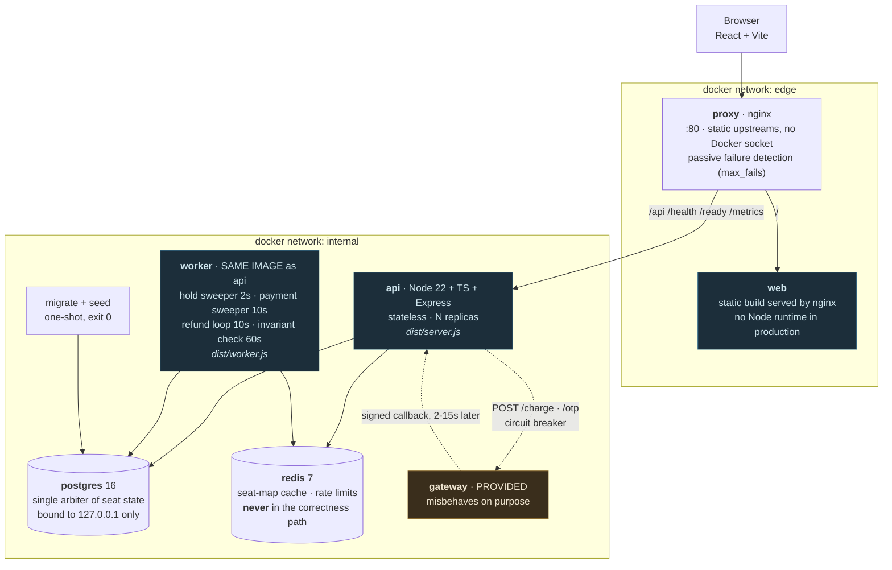

**7 long-running containers + 2 one-shot.** Three of them we wrote (`api`,
`worker`, `web`). One `docker compose up`, no `.env`, no manual steps.

| Container | Why it exists as its own thing |
|---|---|
| `proxy` | Routing at the edge. **nginx, not Traefik** — Traefik v3's Go client pins Docker API 1.24, which Docker Engine 28+ no longer serves, so it could never discover backends. nginx uses static upstreams instead: no Docker socket mounted anywhere, which incidentally closed a finding ([§15, F12](#15-where-it-breaks)) for free. Trade-off: nginx OSS has no active health probing the way Traefik did, so failure detection is passive (`max_fails`/`fail_timeout`) rather than active — see `infra/proxy.conf` |
| `web` | Static assets. Separating it means no Node runtime in production and a ~40 MB image |
| `api` | Stateless and latency-sensitive. All contention resolves in Postgres, so replicas need **zero coordination with each other** |
| `worker` | Slow, throughput-sensitive, and its failures must never touch the request path. **Same image, different entrypoint** — one build, one test suite, two scaling profiles. Four independent loops, not one — see [§15](#15-where-it-breaks) |
| `postgres` | The one source of truth. Every seat decision is made here |
| `redis` | Cache and rate-limit counters. Deliberately load-bearing for *performance*, never for *correctness* |
| `migrate` / `seed` | Migrations are a deploy step, never a boot step inside the app. `api`/`worker` wait for **both**, not just `migrate` |

> **The split cost us**: nothing at build time (shared image), and one extra
> entrypoint file. **It bought us**: the ability to `docker stop worker`
> mid-demo without breaking correctness, because hold expiry is enforced lazily
> in SQL — see [§4](#4-state-machines).

### Why not microservices?

The question deserves a direct answer, because the intuitive case for splitting
is real: *doesn't one service per domain mean payment can fail without taking
booking down?*

**Fault isolation is a property of the failure domain, not of the deployment
unit.** We already have the isolation that argument is reaching for — stop the
`gateway` container entirely and browsing, seat maps and holds keep working, at
`200`, with `/health` green ([§10](#10-failure-isolation), verified 13/13 by
`loadtest/fault-isolation.sh`). We got that from a bulkhead in the code — the
gateway is never called inside a transaction, never called from the callback
handler, and never on the browse path — not from a network boundary.

Splitting would have *added* a failure mode rather than removed one:

- **Confirming a payment moves seats to `BOOKED`.** Same rows, same
  transaction. Split booking from payment and that local transaction becomes a
  distributed one, so we would need a saga.
- **A saga's compensating action here is dangerous.** To undo "confirm the
  seat", you release a seat that someone else may already hold. The
  compensating action *reintroduces the exact oversell the whole system exists
  to prevent* — we would be building machinery to buy back, unreliably, a
  guarantee Postgres gives us for free and atomically.
- **A new network hop is a new source of partial failure.** "Did the payment
  service receive my confirm?" is precisely the question the provided gateway
  already forces us to answer once. We saw no reason to invent a second one
  internally.

What we split instead is the **sync/async seam**: `api` is stateless and
latency-sensitive; `worker` is slow and its failures must never reach a user.
They share an image, so that split cost one entrypoint file. The seams for a
future domain split are already drawn at `src/modules/*` — `catalog` is the one
we would extract first, because it is read-only, has no transactional
relationship with bookings, and is the part a premiere rush hits hardest.

Implemented by [`docker-compose.yml`](../docker-compose.yml) · [`src/server.ts`](../services/api/src/server.ts) · [`src/worker.ts`](../services/api/src/worker.ts)

---

## 2. Data model

Nine tables. The one that matters is `show_seats` — **one row per
(showtime, seat), and that row is what concurrent buyers fight over.**

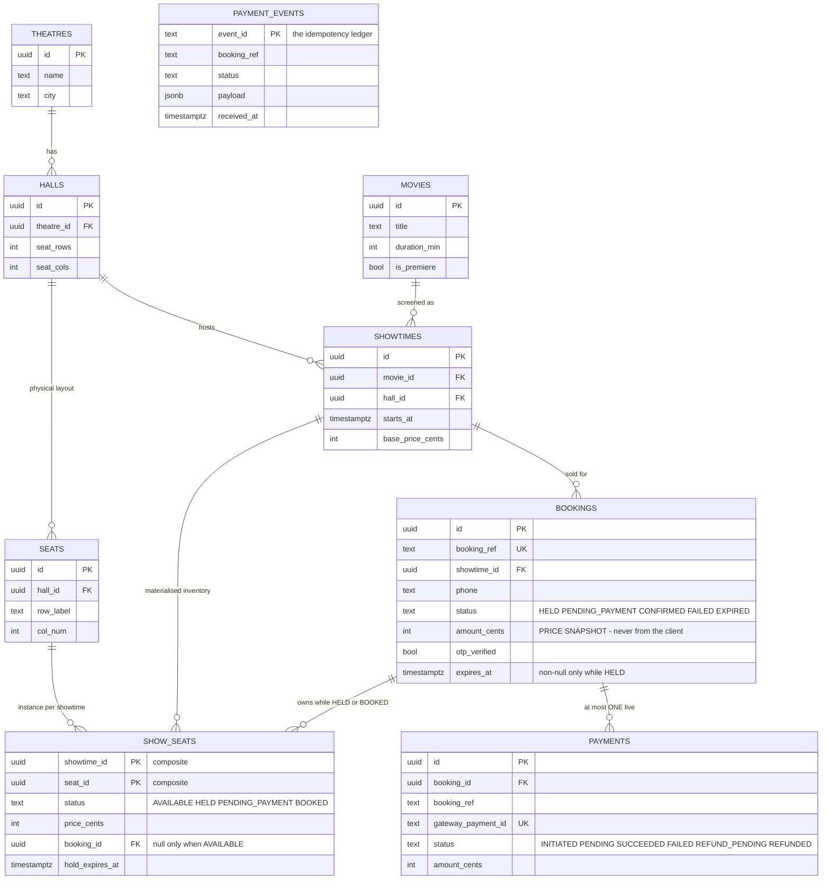

**Why a hold is not its own table.** A hold *is* a booking with an expiry.
Two tables that must agree about the same fact is exactly the trap we avoided in
the locking design, one layer up — and the failure mode is silent, because a row
left in `holds` after its booking exists looks identical to a live hold.

**Why the price lives on the server.** `amount_cents` is computed by summing
`show_seats.price_cents` at hold time ([`booking.repo.ts:69`](../services/api/src/modules/booking/booking.repo.ts#L69)).
The hold request schema has **no price field at all**
([`booking.schema.ts:7-24`](../services/api/src/modules/booking/booking.schema.ts#L7-L24)),
so a client cannot propose one, and a later price change cannot affect a
booking already in flight — the snapshot is taken once and never re-read.

Implemented by [`migrations/001_init.sql`](../services/api/migrations/001_init.sql)

---

## 3. Invariants: what must never be true

The most useful question anyone asked us during review was not *"what happens
if X fails?"* but **"which impossible states have you actually made
impossible?"** Those are different questions, and only the second one has a
verifiable answer.

```mermaid
flowchart TB
    subgraph struct["ENFORCED STRUCTURALLY — the database refuses"]
        direction TB
        I1["Two bookings own one seat<br/><i>composite PK + a single booking_id column:<br/>there is only one place to write an owner</i>"]
        I2["A seat is taken but belongs to nobody<br/><i>CHECK held_seats_have_a_booking</i>"]
        I3["Two live payments for one booking<br/><i>partial UNIQUE INDEX one_live_payment_per_booking</i>"]
        I4["The same gateway callback applied twice<br/><i>payment_events.event_id PRIMARY KEY</i>"]
        I5["A seat exists twice for one showtime<br/><i>PRIMARY KEY (showtime_id, seat_id)</i>"]
        I6["A booking for a seat in another showtime<br/><i>the lock query is scoped by showtime_id;<br/>a mismatch is a 404, not a booking</i>"]
    end

    subgraph disc["ENFORCED BY CODE DISCIPLINE, WATCHED BY A CHECKER — no constraint stops it"]
        direction TB
        D1["A seat is BOOKED while its booking is FAILED<br/><i>only the callback transaction keeps these aligned;<br/>a 60s periodic sweep watches for it, log-only</i>"]
        D2["A booking is CONFIRMED with no SUCCEEDED payment<br/><i>same transaction, same reasoning, same sweep</i>"]
        D3["A hold outlives its booking's expires_at<br/><i>two columns storing one fact:<br/>show_seats.hold_expires_at and bookings.expires_at</i>"]
    end

    classDef ok fill:#1e3a2a,stroke:#3a7a52,color:#d8f0e2;
    classDef warn fill:#3a3320,stroke:#8a7a30,color:#f0e8d0;
    class I1,I2,I3,I4,I5,I6 ok;
    class D1,D2,D3 warn;
```

### The three constraints that make correctness structural, not hopeful

```sql
-- 1. One row per seat per showtime. THIS is the serialization point.
PRIMARY KEY (showtime_id, seat_id)

-- 2. A seat that is not AVAILABLE must belong to a booking.
--    An orphaned hold becomes impossible, not merely unlikely.
CONSTRAINT held_seats_have_a_booking
  CHECK (status = 'AVAILABLE' OR booking_id IS NOT NULL)

-- 3. At most one live payment per booking. A concurrent second /pay
--    hits a 23505 unique violation, not a race.
CREATE UNIQUE INDEX one_live_payment_per_booking ON payments (booking_id)
  WHERE status IN ('INITIATED','PENDING','SUCCEEDED');
```

**We are naming the right-hand box deliberately, even though it now has a
watcher.** Those three states are prevented because every code path that
writes them does so inside one transaction — true today, and exactly the
kind of guarantee that rots the moment someone adds a fourth path. A
periodic checker (`booking.invariants.ts`, run every 60s by the worker) now
watches for the first two and logs loudly if it ever finds one — but it is
insurance, not prevention. The honest description is still "invariant by
convention, monitored", not "invariant by construction".

### What must be atomic, idempotent, consistent

| Operation | Requirement | How it is met |
|---|---|---|
| Claim seats + create booking + expire the previous owner | **Atomic** | One transaction, `booking.repo.ts` |
| Confirm payment + book seats + confirm booking | **Atomic** | One transaction, `payment.repo.ts` |
| Record callback + apply its effect | **Atomic** | One transaction, `recordAndApplyCallback` — see [§7](#7-callback-handling) |
| Gateway callback delivery | **Idempotent** | `event_id` primary key |
| OTP verify | **Idempotent** | Early return if already verified |
| Refund | **Idempotent** | Driven off `status = 'REFUND_PENDING'`, with a terminal `REFUND_FAILED` after permanent rejection or exhausted retries |
| `POST /holds` | **Idempotent** | Optional `Idempotency-Key` header + partial unique index on live holds — see [§15](#15-where-it-breaks) |
| Seat state | **Strongly consistent** | Postgres row locks |
| Seat map | **Eventually consistent** (~1s) | Redis micro-cache; advisory only, by design |
| Refund execution, metrics, cache busts | **May be async** | Worker loops |

**The transactional-outbox question** — *"what if the transaction commits but
publishing the event fails?"* — has two different answers here, and only one of
them was deliberate:

- **Refunds: durable.** The callback handler writes `status = 'REFUND_PENDING'`
  *inside* the transaction, and the worker discovers it by polling the database
  ([`payment.repo.ts`](../services/api/src/modules/payment/payment.repo.ts)).
  That is a transactional outbox: there is no window in which the decision is
  committed but the work is lost, because the decision *is* the work queue.
- **Cache invalidation: fire-and-forget.** `void invalidateSeatMap(...)` is
  called after commit and its failure is swallowed. That is acceptable *only*
  because the cache has a ~1s TTL, so a lost invalidation self-heals in under a
  second, and because the cache is never consulted for a decision.

---

## 4. State machines

Our design *is* a state machine, and it is encoded in `WHERE` clauses rather
than in application `if` statements. That is the whole correctness argument.

### Seat lifecycle — `show_seats.status`

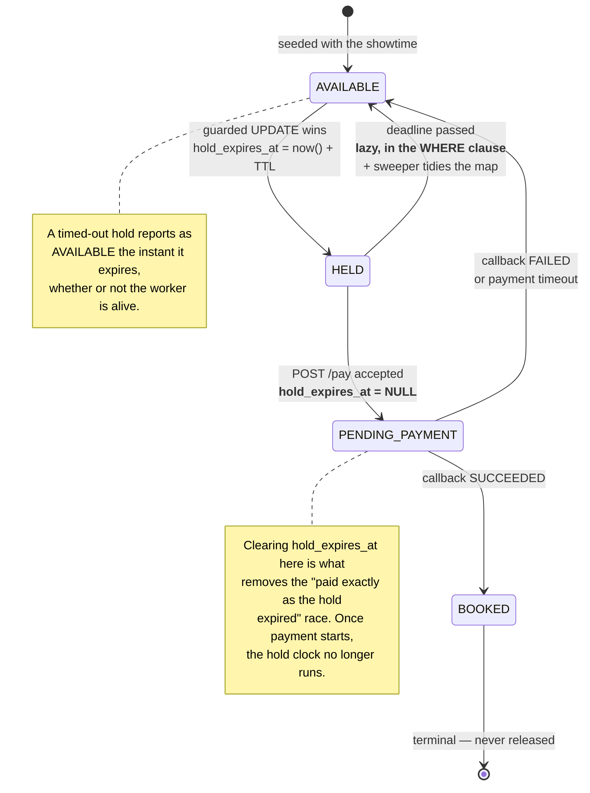

**Why expiry is lazy.** A hold past its deadline is treated as claimable by the
`WHERE` clause of the next hold attempt, and reported as `available` by the seat
map query, *regardless of whether the sweeper has run*
([`booking.repo.ts:91-92`](../services/api/src/modules/booking/booking.repo.ts#L91-L92),
[`catalog.repo.ts:76`](../services/api/src/modules/catalog/catalog.repo.ts#L76)).
The worker exists to keep the map tidy, not to make it correct. This is the
single reason `docker stop worker` is a safe thing to do during a demo.

### Booking lifecycle — `bookings.status`

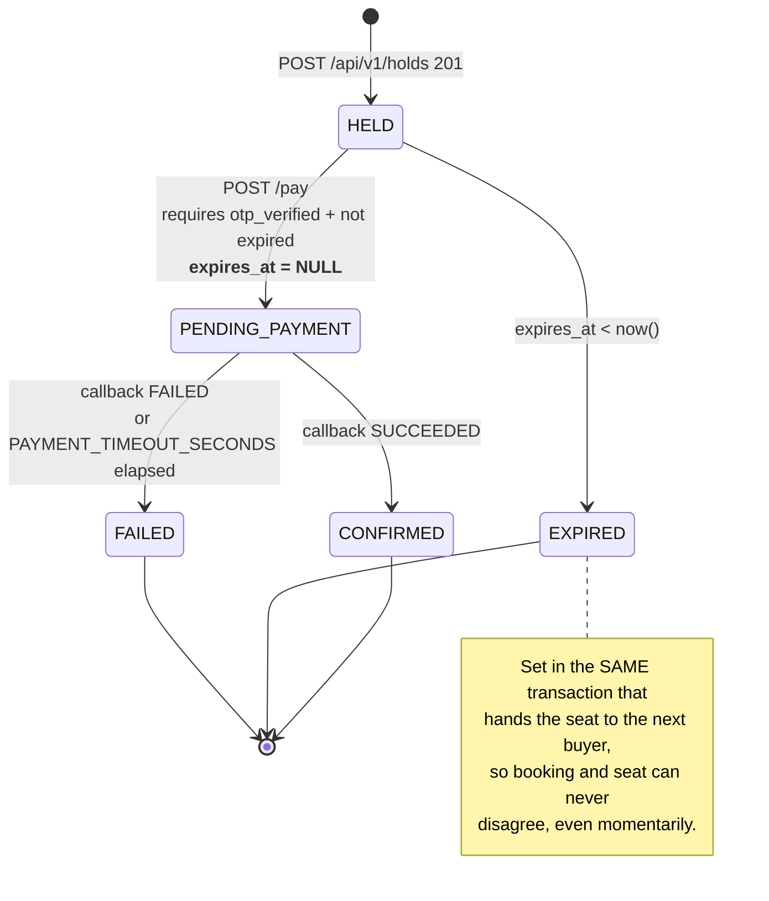

### Payment lifecycle — `payments.status`

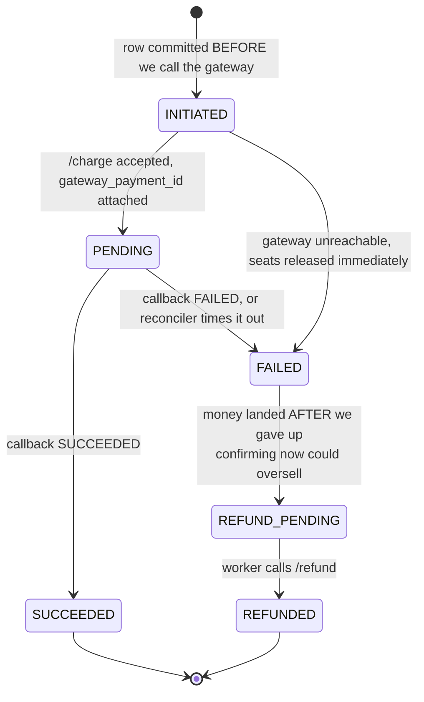

Implemented by [`booking.repo.ts`](../services/api/src/modules/booking/booking.repo.ts) · [`payment.rules.ts`](../services/api/src/modules/payment/payment.rules.ts)

---

## 5. The booking path, end to end

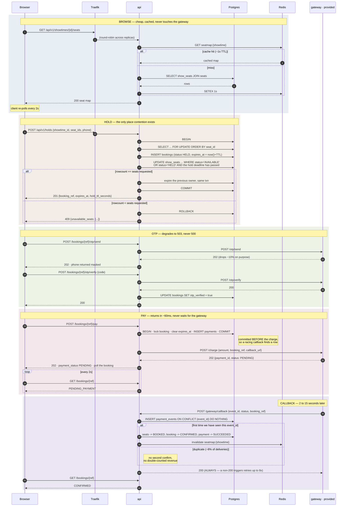

**Four properties worth naming out loud:**

1. `/pay` returns **202 in ~60 ms**. It cannot wait for a gateway that takes
   2–15 s by specification.
2. The payment row is **committed before** `/charge` is called, which is why the
   documented `race` mode (callback before `/charge` returns) works instead of
   losing the event.
3. **No network call ever happens inside a database transaction.** Holding row
   locks across a flaky dependency is how a 2 % gateway timeout becomes a 100 %
   outage.
4. **Confirmation is server-side.** The browser is a poller, not a participant.
   A user who loses their connection the instant after tapping Pay still gets
   the booking — the callback confirms it whether anyone is watching or not.

---

## 6. How contention resolves

Scenario A: 100 concurrent requests for **one** seat. Verified result: **1 hold, 99 clean 409s, oversell 0.**

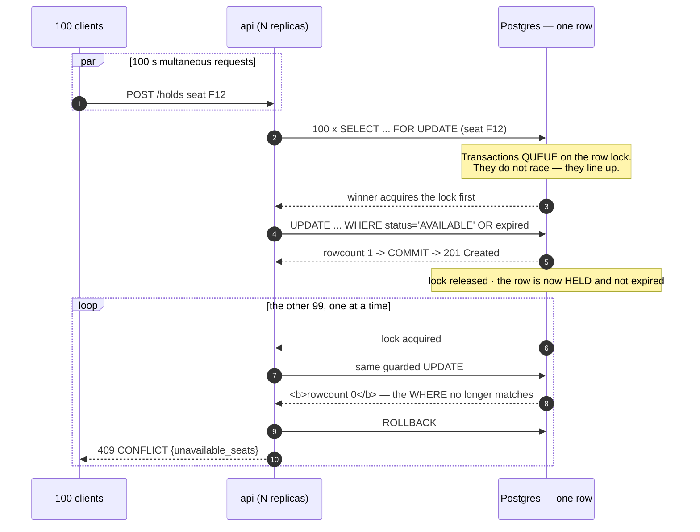

### Why this cannot oversell

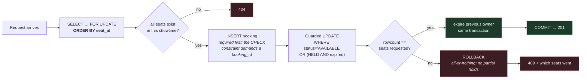

- **Exactly one winner.** The loser's `WHERE` no longer matches when its turn
  comes. Overselling is not unlikely — it is *unrepresentable*.
- **All-or-nothing.** A multi-seat request that cannot claim every seat rolls
  back entirely.
- **Ordering by `seat_id` prevents deadlock** between two overlapping
  multi-seat requests, because every transaction takes locks in the same order.
  That guarantee holds **between two holds**; it does not extend to the sweepers
  — see [§8](#8-lock-ordering-and-deadlock).

### The `now()` nuance, stated before anyone finds it

Postgres `now()` is `transaction_timestamp()` — **frozen at `BEGIN`**, not read
from the wall clock. Under Scenario A, transactions queue on the row lock, so a
transaction that waited 800 ms still evaluates `hold_expires_at < now()` against
its own start time.

For oversell this is **conservative and therefore safe**: a queued loser sees a
hold as *newer* than it really is, so it declines to steal a seat it might
legitimately have been able to take. It never goes the other way.

The cost would otherwise land elsewhere: writing the new deadline from that
same frozen clock would make a hold granted after a long queue born slightly
short — with the very small `HOLD_TTL_SECONDS` a judge might use to watch
expiry, a request that queued longer than the TTL could receive a `201` for a
hold that is already expired. Fixed: `holdSeats` writes
`hold_expires_at`/`expires_at` with `clock_timestamp()`, which reads the real
time at the moment of the write, while the *comparison* against an existing
deadline keeps using `now()` deliberately — that asymmetry is the point.
Comparisons want the conservative, frozen read; new deadlines want the
accurate one.

Verified by [`booking.concurrency.test.ts`](../services/api/src/modules/booking/booking.concurrency.test.ts) (50 simultaneous holds, real Postgres) and [`loadtest/scenario-a.py`](../loadtest/scenario-a.py) (100 concurrent, against the running stack).

---

## 7. Callback handling

The gateway delivers ~8 % of callbacks twice, retries anything not answered
`200` up to 8 times, and can deliver out of order. Idempotency is therefore a
**primary key**, not a `SELECT`-then-`INSERT`.

**The transaction boundary is the point of this diagram.** Recording that
we've seen this `event_id` and applying its effect are **one transaction**,
not two — `recordAndApplyCallback` in `payment.repo.ts`. An earlier version
had these as two separate operations (an autocommit insert, then a second
transaction), and a failure between them could mark an event permanently
"seen" with nothing applied. Fixed: now a rollback undoes the ledger entry
along with everything else, so the gateway's retry lands on a clean slate
instead of being deduped away.

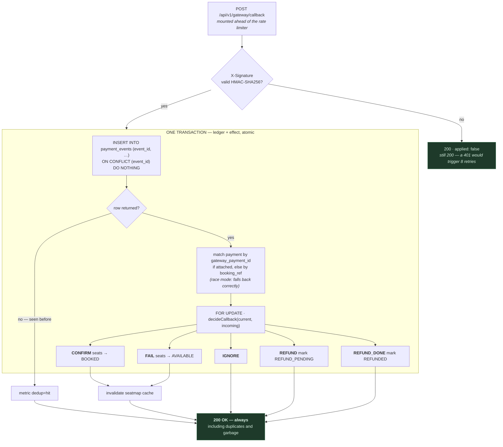

### The decision table

Two API replicas can receive the same duplicate simultaneously and exactly one
will apply it, because the arbiter is a database constraint.

| Payment is | Callback says | Action | Why |
|---|---|---|---|
| `PENDING` | `SUCCEEDED` | **CONFIRM** | the normal path |
| `SUCCEEDED` | `SUCCEEDED` | **IGNORE** | duplicate — no second confirm, no double revenue |
| `SUCCEEDED` | `FAILED` | **IGNORE** | a late failure must never revoke a paid ticket |
| `PENDING` | `FAILED` | **FAIL** | release the seats |
| `FAILED` | `SUCCEEDED` | **REFUND** | we already released those seats and someone else may hold them — confirming would oversell |
| `REFUND_PENDING` | `REFUNDED` | **REFUND_DONE** | the gateway confirming a refund we issued — close out the payment row |

**Why we always answer 200.** A non-200 tells the gateway delivery failed and it
retries up to 8 times with backoff. Rate-limiting or rejecting the gateway
therefore produces strictly *more* traffic than accepting it. This is why the
callback route is mounted ahead of the limiter
([`app.ts`](../services/api/src/app.ts)) — and why an invalid signature still
answers 200 rather than 401.

**Why the signature check exists.** The gateway HMAC-SHA256 signs every
callback as `X-Signature`. Without verifying it, anyone who can reach the
endpoint could forge a `SUCCEEDED` callback and confirm a booking that was
never paid for. `app.ts`'s `express.json()` stashes the raw request bytes
onto `req.rawBody` (via its `verify` hook) specifically so the HMAC can be
computed over the exact bytes on the wire — a re-serialised JS object is not
guaranteed to reproduce them.

Implemented by [`payment.repo.ts`](../services/api/src/modules/payment/payment.repo.ts) (the transaction) and [`payment.rules.ts`](../services/api/src/modules/payment/payment.rules.ts) (the decision table), covered by 15 pure unit tests plus 11 integration tests against a real database — including a regression test that forces the old two-transaction failure mode and asserts it can no longer happen ([`payment.callback.test.ts`](../services/api/src/modules/payment/payment.callback.test.ts)).

---

## 8. Lock ordering and deadlock

`holdSeats` takes row locks in `seat_id` order so that two overlapping
multi-seat requests queue instead of deadlocking. That is true, tested, and
**only covers hold-versus-hold.** The recovery paths acquire the same three
tables in a different order.

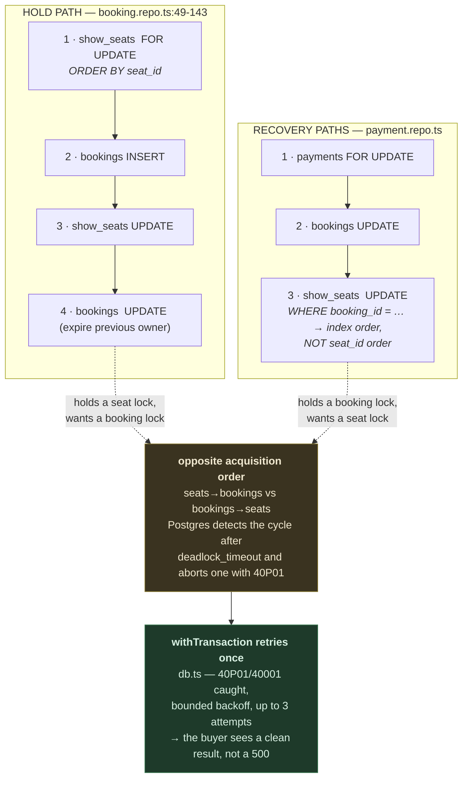

**How likely is it, honestly?** Low. The windows are narrow, because the hold
path only reaches step 4 if it *won* every seat, and the recovery paths mostly
touch bookings in states the hold path cannot claim. We have not observed it.
But "we have not observed it" is not the same as "it cannot happen", and the
mitigation is now in place: `withTransaction` retries a `40P01`/`40001` up to
3 attempts with backoff before giving up. It's safe specifically *because* no
network call ever happens inside a transaction — a retried transaction
function is a clean, self-contained re-execution with nothing external to
duplicate. (Not independently tested — reliably forcing a cross-path
deadlock on demand is its own project; the existing overlapping-seats test
still covers same-path deadlock avoidance via lock ordering.)

**What *cannot* collide, and why that was designed rather than lucky:**

- **The expiry sweeper and a paying booking.** `sweepExpiredHolds` only matches
  `status = 'HELD'`; a booking in payment is `PENDING_PAYMENT` with
  `expires_at = NULL`. They cannot select the same row.
- **The payment sweeper and a callback.** Both take `FOR UPDATE` on the
  *payment* row before doing anything else, so they serialise on it. Whichever
  arrives second sees the state the first one wrote and `decideCallback` handles
  it.

---

## 9. The timeout budget

*"What about network delay?"* is really several questions. The answer that
matters is: **which waits are bounded, and what does an unbounded one cost?**

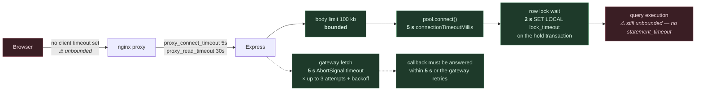

**What is bounded, and why:**

- **Every outbound gateway call** is time-boxed at `GATEWAY_TIMEOUT_MS` (5 s)
  with `AbortSignal.timeout`
  ([`gateway.ts`](../services/api/src/lib/gateway.ts)). An unbounded
  await on a flaky dependency is how one slow gateway exhausts a connection
  pool.
- **The callback handler does no network I/O at all** — deliberately, because
  the gateway abandons delivery after 5 s and retries. A refund is recorded as a
  state, never awaited.
- **`/pay` never waits for the outcome.** The client's latency is decoupled from
  the gateway's, which is the whole reason a 2–15 s callback delay is survivable.
- **The pool** refuses to wait more than 5 s for a connection.
- **The row lock a hold transaction waits on** now gives up after 2 s
  (`SET LOCAL lock_timeout`), mapped to a clean `503` with `Retry-After: 2`
  instead of holding a pool connection indefinitely. This was the honest
  answer to Scenario C, and it is no longer a gap — see [§15](#15-where-it-breaks).

**What is still not bounded:** raw query execution time has no
`statement_timeout`. In practice this matters less now that the lock wait
itself is capped — a query that's actually running (not waiting on a lock)
in this codebase is always one of the two-statement guarded transitions, with
no application logic or network calls inside it, so there's little room for
one to run long. A `statement_timeout` would still be a reasonable belt
alongside the lock_timeout suspenders; we chose the lock timeout first
because it's the one with an observed failure mode.

---

## 10. Failure isolation

The `api` container has **no compose dependency on `gateway`**, deliberately.

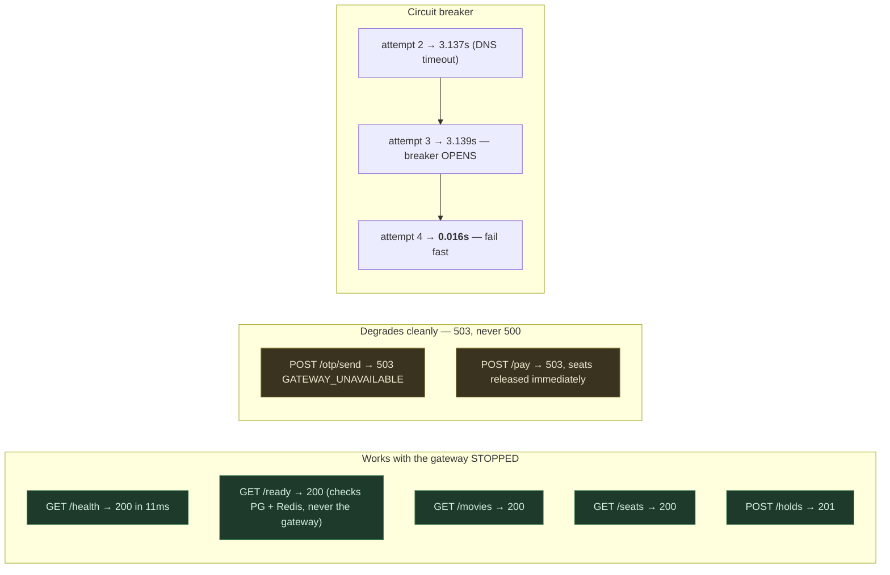

**Why the breaker matters, in one sentence:** a dead dependency costs ~4 s per
call in DNS timeout, and under load each of those *occupies a request slot doing
work that cannot succeed* — so the dead gateway was quietly eating the API's
capacity. Three consecutive failures now open the circuit for 10 s, and
exactly one probe is admitted once the cooldown elapses — a `probing` flag
claimed by the first caller past it, so a burst of concurrent requests
doesn't all pile a fresh ~4 s probe onto a gateway that may still be dead.
`circuitState()` is a pure read with no side effect, so a metrics scrape can
no longer consume the one probe slot a real request should have gotten.

One caveat we'd rather state than have found: the breaker is per-process, so
three replicas trip independently — a dead gateway costs up to 3× the probes
a single shared breaker would. A Redis-backed breaker would fix it; we
judged the complexity not worth it at three replicas.

Verified by [`loadtest/fault-isolation.sh`](../loadtest/fault-isolation.sh) — 13/13 passing.

---

## 11. What happens if…

The failure catalogue, answered. A ⚠ marks the two rows where the honest
answer is still a gap; every ✅ used to be a ⚠ and is now backed by a test.

### Concurrency

| Question | Answer |
|---|---|
| 100 people book the same seat at the same time? | They queue on one row lock. One `201`, 99 `409`s naming the seat. Oversell 0, verified |
| Two requests arrive in the same millisecond? | There is no such thing at the row-lock level — Postgres serialises them. They do not race, they line up |
| Two buyers request overlapping seat sets (A1+A2 vs A2+A3)? | `ORDER BY seat_id` on the `FOR UPDATE` — identical lock order, so they queue instead of deadlocking |
| A multi-seat request wins some seats and loses one? | `rowcount != requested` → `ROLLBACK`. All-or-nothing; no partial holds |
| The app crashes halfway through a transaction? | Postgres rolls back when the connection drops. The seat was never taken — including the callback path, now that recording and applying a callback are one transaction ✅ |
| The same booking request is sent twice? | ✅ An optional `Idempotency-Key` header returns the caller's own prior hold (`200`) instead of fighting it with a second, independent attempt |
| The user retries because the first request timed out? | ✅ Same mechanism. If the first response was lost, the retry with the same key still returns the original `booking_ref` rather than leaving it orphaned |
| A hot seat is queued on so long a request would rather give up? | ✅ `SET LOCAL lock_timeout = '2s'` — a clean `503` after 2s instead of an indefinite wait holding a pool connection |

### Time and abandonment

| Question | Answer |
|---|---|
| The user closes the browser after selecting a seat? | The hold expires at `hold_expires_at`. Verified end to end by Scenario B |
| A seat is held forever? | Impossible. Every hold carries a deadline, enforced lazily in the `WHERE` clause and swept for tidiness |
| The server crashes after the seat is held? | The hold is in Postgres with its deadline. It expires on schedule with no process alive to help |
| The expiry worker is stopped? | Holds still expire. The worker only keeps the seat map tidy |
| **Payment succeeds exactly as the hold expires?** | **Designed out.** `/pay` sets `expires_at = NULL` and `hold_expires_at = NULL` in the same transaction that moves the booking to `PENDING_PAYMENT`. Once payment starts the hold clock stops, so there is no race to lose. The only remaining timer is `PAYMENT_TIMEOUT_SECONDS` |
| **The expiry worker and the payment webhook update the same booking?** | **They cannot select the same row.** The sweeper matches `status='HELD'`; a paying booking is `PENDING_PAYMENT`. And the *payment* sweeper and the callback both take `FOR UPDATE` on the payment row first, so they serialise |

### Gateway and money

| Question | Answer |
|---|---|
| Payment takes 15 seconds? | Expected. `/pay` returned `202` in ~60 ms; the client polls |
| `/charge` times out or 500s? | Retried up to 3× with backoff, **now with a stable `Idempotency-Key`** so a retry the gateway did receive can't become a second charge, then `503` and the seats are released immediately rather than pinned until the sweeper notices |
| Payment succeeds but we never receive the webhook? | The reconciler fails the payment after `PAYMENT_TIMEOUT_SECONDS` and releases the seats. The money is gone and only a later callback can trigger a refund — this is inherent to the gateway's design, not a gap; see the coupled-timeout note below |
| The same webhook arrives multiple times? | `payment_events.event_id` is a primary key, and the insert plus the effect it triggers are now one transaction. The second insert returns no row and we do nothing, still answering `200` |
| A webhook arrives *before* our transaction finishes? | The documented `race` mode. The payment row is committed *before* `/charge` is called, so the callback always finds a row. `attachGatewayPaymentId` uses `COALESCE` so it never clobbers what the callback wrote |
| A webhook arrives *after* the booking expired? | `decideCallback(FAILED, SUCCEEDED)` → **REFUND**. We must not resurrect a booking whose seats someone else may now hold |
| A late `FAILED` after a `SUCCEEDED`? | `IGNORE`. Never revoke a paid ticket |
| The user pays twice / two payment attempts? | `one_live_payment_per_booking` partial unique index → `23505` → `409`. A constraint, not a race |
| The user refreshes the payment page? | `GET /bookings/:ref` is a pure read. Nothing re-fires |
| **The user loses internet immediately after paying?** | Nothing changes server-side. The callback confirms the booking whether or not anyone is listening; the user sees `CONFIRMED` whenever they next load the page. This is the payoff for decoupling `/pay` from the callback |
| A refund fails? | ✅ A permanent gateway rejection (404/409) or `MAX_REFUND_ATTEMPTS` (5) transient failures now moves it to a terminal `REFUND_FAILED` state instead of retrying every 10s forever |
| A payment is stuck `PENDING` forever? | `sweepTimedOutPayments` fails it and releases the seats |
| Our system is down for an hour? | The gateway retries a callback 8 times over ~91s, then gives up — any outage longer than that loses the callback permanently. `PAYMENT_TIMEOUT_SECONDS` (90) is deliberately kept under that window, documented and asserted at boot in `env.ts`, so our own timeout never fires *before* the gateway has genuinely given up |

### Trust and tampering

| Question | Answer |
|---|---|
| **The client sends a fake price?** | **It cannot.** There is no price field in the hold request schema. `amount_cents` is summed from `show_seats.price_cents` server-side and snapshotted onto the booking |
| **The price changes while someone is booking?** | The snapshot is taken at hold time and never re-read, so an in-flight booking is immune to a later change |
| **Someone books a seat belonging to another showtime?** | The lock query is scoped `WHERE showtime_id = $1 AND seat_id = ANY($2)`. A seat that is not in that showtime simply is not returned, the count check fails, and the response is a `404` naming the offending IDs |
| A user changes the booking ID in the URL? | The format is validated (`bk_` + 12 hex); an unknown ref is a `404`. There is still **no ownership check** — see [§15](#15-where-it-breaks), "no authentication" |
| An attacker guesses booking IDs? | `bk_` + 12 hex = 48 bits ≈ 2.8 × 10¹⁴. Brute force is not the realistic threat; a *leaked* reference is |
| An attacker forges a payment callback? | ✅ Every callback's `X-Signature` (HMAC-SHA256) is now verified against the exact raw bytes before the body is even parsed. An invalid or missing signature is acknowledged (`200`, `applied: false`) but changes nothing |
| Bots flood the booking API? | 2000 requests/minute/IP — set deliberately high so Scenario A is not throttled by us, which makes it a weak bot defence. And the limiter **fails open**, so a Redis outage removes it entirely — an accepted trade-off, not a gap: we would rather serve traffic than 500 the whole API over a cache blip |

### Infrastructure

| Question | Answer |
|---|---|
| Redis goes down? | Rate limiting fails open; the seat map falls through to Postgres. Degraded performance, not an outage. Correctness is untouched — Redis is never consulted for a decision |
| **The cache says available but Postgres says booked?** | **That is the normal case, not an error.** The map is advisory; the guarded `UPDATE` is authoritative. The user gets a `409` naming the seat — the same answer they would get in a genuine race with a perfectly fresh map |
| The frontend shows an outdated seat map? | Up to ~2 s stale by design. A seat can be taken between render and click no matter how fresh the map is, so the `409` path has to be correct anyway |
| Postgres goes down? | ✅ `/ready` reports 503, the seat map falls through, and requests now surface as a clean `503` (mapped from the connection error), matching how Redis-down already degraded |
| The read replica is behind the primary? | We have none. It is step 2 of the scaling fix order in [§15](#15-where-it-breaks) |
| The connection pool is exhausted? | 10 per replica. Blocked holds used to hold connections indefinitely while queued; now bounded to 2s by `lock_timeout`, so exhaustion self-heals instead of compounding |
| The app server is overloaded? | The nginx proxy passively marks a backend down after 3 failures (`max_fails`) rather than continuing to hammer it — see [§1](#1-system-topology) and [§15](#15-where-it-breaks) for what this does and doesn't cover with only one replica configured by default |
| PostgreSQL becomes the bottleneck? | Expected, and deliberate. Fix order: PgBouncer → read replica for seat maps → partitioned inventory with `SKIP LOCKED` |
| 500,000 users arrive at once? | The pool saturates first, then the hot row, then primary CPU. Browsing degrades along with holds because they share a pool — the honest answer is that we would need a queue in front of the premiere showtime, not just more replicas |
| A background worker crashes mid-job? | Refunds are driven by polling `payments WHERE status='REFUND_PENDING'`, so the work is recovered on the next tick. Nothing is held in memory |
| The message broker goes down? | Moot — there is no message broker. The Redis job queue this would have referred to was unused scaffolding and has been deleted; refunds go through the database, which is a transactional outbox |
| An event is delivered twice / never delivered? | Twice: `event_id` primary key, and now atomic with its effect. Never: the reconciler is the backstop for every lost callback |

---

## 12. Alternatives we rejected

| We could have | Why we did not |
|---|---|
| **Redis `SET NX` distributed lock** per seat | Two sources of truth. A `maxmemory` eviction, a Redis restart, or a lock TTL expiring while the holder still works makes the lock and the database disagree — and that disagreement surfaces as a double-booked seat. **Correctness would depend on a cache.** |
| **Optimistic locking** (version column + CAS retry) | Optimistic works when conflicts are rare. Our entire problem is *conflicts are the common case* — 100 buyers, one row. That is 99 retries in a storm. |
| **`SERIALIZABLE` isolation** | Produces serialization failures we would have to catch and retry, turning a clean `409` into the same retry storm. Read Committed + an explicit row lock gives identical safety with predictable behaviour. |
| **In-process mutex / queue** | Dies the moment there is more than one API replica — which is the first thing we do under load. Said out loud only to rule it out. |
| **Microservices split by noun** (booking / payment / catalog) | Confirming a payment moves seats to `BOOKED` — same rows, same transaction. Splitting turns a local transaction into a distributed one, and the compensating action for "confirm the seat" is releasing a seat someone else may now hold. See [§1](#why-not-microservices). |
| **A document store** (Mongo / DynamoDB) | The invariant spans three tables in one atomic write. Per-document atomicity means rebuilding the rest as application-level compensation. |
| **Separate `holds` and `bookings` tables** | Two tables that must agree about the same fact — the same trap as the Redis lock, one layer up, and its failure mode is silent. |
| **Event-sourced seat state** | Genuinely appealing for ticketing, and rejected purely on time: it needs replay-on-read or a projection to keep in sync. |
| **WebSocket / SSE push** for the seat map | Stateful connections behind a load balancer need sticky sessions or a Redis pub/sub fan-out — a second delivery system, and thousands of open sockets is a new failure mode on the day we can least afford one. It also breaks the trivial horizontal scalability everything else rests on. Since the `409` path must be correct anyway, push buys polish, not correctness. |
| **Kubernetes** | Compose is what the brief asks for by name. K8s is 45 minutes of YAML for zero additional guarantee at this scale. |

---

## 13. CI/CD pipeline

One workflow, change-aware. **Nothing merges without CI; nothing deploys without a merge.**

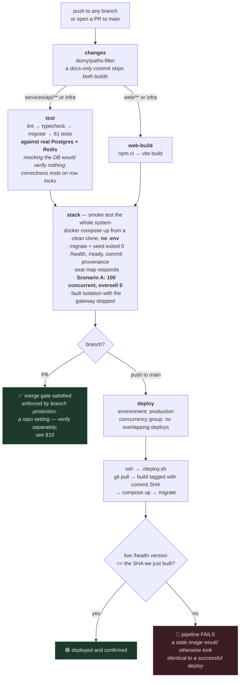

**The provenance check is the part we are proudest of, and it came from a real
bug.** Compose compares image *names* when deciding whether to recreate a
container, so a rebuilt `:latest` left the old container running — twice we
"deployed" and then tested old code. Images are now tagged by commit SHA,
`/health` reports the SHA it was built from, and both `deploy.sh` and the
pipeline fail loudly if live ≠ built.

**One honest caveat left.** The deploy builds images **on the production
host** rather than pulling a pre-built tag, which costs CPU the live app
needs and makes the recreate window longer than it has to be — deliberately
deferred, see [§15](#15-where-it-breaks). (The `stack` gate used to have a
second hole — it treated a *cancelled* job the same as a passing one, since
`cancelled` isn't `failure` and `cancel-in-progress: true` makes cancellation
routine on every superseding push. Fixed: the condition now excludes both.)

Implemented by [`.github/workflows/ci.yml`](../.github/workflows/ci.yml) · [`deploy.sh`](../deploy.sh)

---

## 14. Deployment topology

Nothing is configured by hand. The lab account is disposable, so **the
deployment is reproducible from a clean clone** — that is a design constraint,
not a nicety.

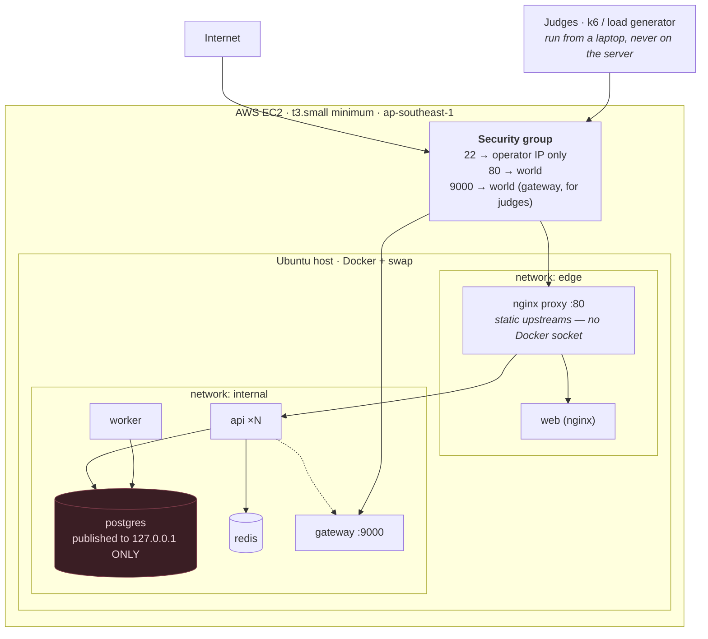

Three decisions worth pointing at:

- **Postgres is published as `127.0.0.1:55432:5432`, not `5432:5432`.** Docker's
  iptables rules are traversed *before* ufw's, so a bare port mapping would have
  published the database to the open internet regardless of the firewall.
- **`t3.small` minimum.** `t2.micro`'s 1 GB cannot hold seven containers; we
  found this the hard way.
- **The proxy is nginx, not Traefik, and mounts no Docker socket at all.**
  Traefik v3's Go client pins Docker API 1.24, which Docker Engine 28+ no
  longer serves, so it could never discover backends on a current host —
  an unrelated compatibility break forced the swap. The upside: nginx uses
  static upstreams, so there is no socket mount and no `:ro`-doesn't-mean-
  read-only exposure to worry about. The downside is in [§15](#15-where-it-breaks) —
  nginx OSS can't do the active health-aware routing Traefik did.

Provisioning: `bash infra/ec2-setup.sh <repo-url>` — installs Docker, adds swap,
clones, generates `.env`, runs `./deploy.sh`. Redeploys are one command.

---

## 15. Where it breaks

This section is a record, not a warning label. Everything in it was found by
reading our own code against the failure catalogue in
[§11](#11-what-happens-if), and **23 of the 25 findings below are now fixed
and covered by tests** — 61 passing, up from 42, including a regression test
for the one that mattered most. Two remain open, both by deliberate choice,
not oversight, and both are named in the last group.

We are keeping the fixed items in this section, not deleting them, for the
same reason a lab notebook doesn't erase a failed experiment: "we found this
and closed it" is a stronger claim to be able to make than silence, and the
regression tests are the proof, not the prose.

### Scaling ceiling — unchanged, still the honest fix order

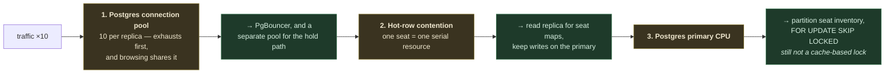

Bottleneck 1 is less severe than it was — `lock_timeout` (below) means a
blocked hold no longer occupies a connection *indefinitely* — but the order
is unchanged. This is still the honest answer to "what breaks first".

### Fixed, and how we know

| # | What was wrong | What we did | Proof |
|---|---|---|---|
| **F4** ★ | The callback ledger insert and its effect were two separate transactions. A failure between them left an `event_id` permanently marked "seen" with nothing applied — the gateway's retry was then silently deduped forever. **Money could be taken with no ticket issued and no refund triggered.** | One transaction (`recordAndApplyCallback`) for both | Regression test forces the exact failure (a 23505 mid-transaction) and asserts the ledger row does not survive rollback, then replays and confirms — [`payment.callback.test.ts`](../services/api/src/modules/payment/payment.callback.test.ts) |
| **F19** | `POST /holds` had no idempotency key — a retry after a timeout `409`'d against the caller's own hold, or worse, left seats locked under a `booking_ref` the caller never received | Optional `Idempotency-Key` header, partial unique index on live holds, savepoint-guarded replay on conflict | `booking.concurrency.test.ts` — sequential replay, concurrent race, and independence of distinct keys |
| **F6** | Callback endpoint had no signature check and no size/rate bound — anyone could forge a `SUCCEEDED` callback or flood `payment_events` | `X-Signature` (HMAC-SHA256) verified against raw request bytes before parsing; still 200 on mismatch | Manual verification (curl without a signature → `applied: false`); see `payment.routes.ts` |
| **F5** | Two problems in one: retrying `/charge` without an `Idempotency-Key` risked a genuine double charge on a timeout, and matching callbacks by `booking_ref` alone could misapply one to the wrong payment attempt | `Idempotency-Key: charge:<booking_ref>` on every `/charge` attempt; callback matching now prefers an exact `gateway_payment_id`, falling back to `booking_ref` only when unattached (race mode) | `payment.callback.test.ts` — race-mode fallback and wrong-attempt isolation cases |
| **F1** | The load balancer health-checked `/health` (which checks nothing by design), so a replica with a dead DB pool stayed in rotation | *Adapted, not a direct port* — the proxy is now nginx, not Traefik (see [§1](#1-system-topology)); added passive failure detection (`max_fails=3 fail_timeout=10s`), the closest nginx-OSS equivalent | `infra/proxy.conf`, reasoning written in place |
| **F8** | No `lock_timeout` — a request blocked on a hot seat row waited indefinitely, holding a shared pool connection the whole time | `SET LOCAL lock_timeout = '2s'` on the hold transaction, mapped to a clean `503 SEAT_BUSY` | Deterministic test: a second connection holds the row lock open manually, hold attempt asserted to fail with `55P03` inside the timeout window |
| **F7** | Lock acquisition order differs between the hold path and recovery paths; a resulting deadlock surfaced as an unhandled 500 | `withTransaction` retries `40001`/`40P01` up to 3× with backoff — safe because no network call ever happens inside a transaction | Not independently tested (see reasoning in [§8](#8-lock-ordering-and-deadlock)) |
| **F10** | Neither sweeper had a `LIMIT` — a mass expiry after a spike could be one transaction holding thousands of row locks | Both bounded to 500/batch, `FOR UPDATE SKIP LOCKED`, service layer loops in capped batches | Exercised indirectly by the existing sweeper tests; batch size is a named constant (`SWEEP_BATCH_SIZE`) |
| **F11** | Refund processing and payment-timeout sweeping shared one loop — a slow gateway could delay the sweep that releases seats | Split into independent worker loops | `worker.ts` — `runPaymentSweeper` and `runRefundProcessor` |
| **F20** | A Postgres outage surfaced as a generic `500`, unlike Redis-down's graceful degradation | Connection-level pg errors mapped to `503 SERVICE_UNAVAILABLE` | `errorHandler.ts` — `isDatabaseUnavailable` |
| **F21** | No way to release a hold early — an abandoning user waited out the full TTL | `DELETE /api/v1/holds/:ref` | `booking.concurrency.test.ts` — release then immediate re-claim by a different buyer |
| **F9** | Hold/seat expiry was computed from `now()` (transaction-start time), so a hold granted after a long queue could be born short | Deadline writes use `clock_timestamp()`; comparisons against an *existing* deadline deliberately keep `now()` | Reasoning in [§6](#the-now-nuance-stated-before-anyone-finds-it) |
| **F24** | `decideCallback`'s `REFUNDED` branch was dead code — a webhook-confirmed refund never recorded `REFUNDED` | New `REFUND_DONE` action, distinct from `CONFIRM` | `payment.rules.test.ts`, `payment.callback.test.ts` |
| — | Refunds retried a *permanent* gateway rejection (404/409) forever, identically to a transient one | `REFUND_FAILED` terminal state after a permanent rejection or `MAX_REFUND_ATTEMPTS` (5) transient ones | `payment.service.ts` — `processRefunds` |
| **F25** | Unused Redis job-queue code, and a documented "jobs can be lost" limitation for a mechanism nothing called | `lib/queue.ts` and its blocking Redis client deleted; the metric it fed replaced with the circuit breaker's state | Diff, not a test — dead code doesn't need a regression test, it needs removing |
| **F2** | Circuit breaker's half-open state let through *every* concurrent caller after cooldown, not one probe | `probing` flag claimed by the first caller past cooldown | Reasoning in [§10](#10-failure-isolation); not independently timed-tested |
| **F3** | `circuitState()` mutated breaker state — a diagnostics read could consume the one half-open probe slot | Pure read, no side effect | Same file, `gateway.ts` |
| **F13** | `api` didn't wait for `seed` — a request in the first seconds after `docker compose up` could see an empty catalogue | `depends_on: seed: service_completed_successfully` added to `api` and `worker` | Manual: `docker compose up -d` then immediate curl |
| **F15** | CI's `stack` gate treated a *cancelled* job the same as a passing one | Condition now excludes `cancelled` alongside `failure` | `ci.yml` |
| **F17** | Deploy workflow's repo URL was hardcoded | Derived from `github.server_url`/`github.repository` | `ci.yml` |
| **F23** | `BOOKED` seats and `CONFIRMED` bookings kept aligned only by convention, no constraint | Periodic log-only consistency check, every 60s | `booking.invariants.ts` — deliberately never mutates; see [§3](#3-invariants-what-must-never-be-true) |
| **F22** | The coupling between `PAYMENT_TIMEOUT_SECONDS` and the gateway's ~91s callback retry window was real but undocumented | Documented in `env.ts` with the reasoning, plus a boot-time warning if the timeout is ever raised past that window | `env.ts` |
| **F18** | No integration test for the duplicate-callback path — only the pure decision function was tested | New `payment.callback.test.ts`, 11 tests against a real database | The tests themselves; count went 42 → 61 |
| **F12** | Traefik mounted the Docker socket for service discovery | Resolved as a side effect of the Traefik→nginx swap (unrelated Docker API compatibility break) — nginx uses static upstreams, no socket needed | `docker-compose.yml`, `infra/proxy.conf` |

### Still open, on purpose

| # | What's wrong | Why it's still open |
|---|---|---|
| **F14** | Deploys build images **on the production host**, competing with the live app for CPU and lengthening the recreate window | Genuinely lower value than the correctness fixes above, and the deploy pipeline was independently reworked around the same time — restructuring it further in the same pass risked an unreviewable diff. Proper fix: build+push to a registry in CI, pull a tag on the host, rolling replace |
| **F16** | *"Nothing merges without CI"* is enforced by GitHub branch protection — a repository setting, not something any workflow file can guarantee | Not a code change. Two minutes on GitHub: Settings → Branches → require status checks for `main`. Should be verified before judging, not assumed from the workflow file existing |

### Known limitations we accept regardless

- **Postgres is a single point of failure** and the scaling ceiling. Deliberately — see the fix order above.
- **The proxy is a single instance**, with a passive rather than active health check (see F1 above). In a real deployment this is an ALB, or nginx-plus/OpenResty for dynamic backend discovery.
- **The circuit breaker is per-process.** Three replicas trip independently — a dead gateway costs up to 3× the probes a shared breaker would.
- **Rate limiting uses a fixed window**, permitting a 2× burst across a boundary, and **fails open** — so a Redis outage removes it entirely. Accepted: we would rather serve traffic than 500 the API over a cache blip.
- **Migrations are forward-only.** No down migrations, no automated backups.
- **No authentication.** `booking_ref` is a bearer token: anyone holding one can act on the booking. Scoped out on purpose to protect the correctness work.
- **The seat map can be ~2 s stale.** The map is advisory; the `409` is authoritative.
- **No distributed tracing.** Structured logs with request IDs and Prometheus metrics, but no span propagation.

**The known-good ordering trade we would defend if asked:** under 100:1
contention we `INSERT` 100 booking rows and roll back 99, generating dead
tuples. The insert has to come first because the `held_seats_have_a_booking`
CHECK requires a `booking_id` before a seat may leave `AVAILABLE`. Dead tuples
are a vacuum problem; an unconstrained seat is a correctness problem.

---

## 16. Out of scope

The brief scopes these out; we are naming them so it is clear the omissions are
decisions rather than oversights.

| Not built | What it would need |
|---|---|
| Ticket generation and QR codes | A `tickets` table with a signed payload; issuance in the same transaction as `CONFIRMED` so a ticket cannot exist for an unconfirmed booking |
| Gate scanning, double-scan, forged QR | A `scanned_at` column and a guarded `UPDATE … WHERE scanned_at IS NULL` — the same pattern as the seat hold, and the same reason it would be race-free. Forgery is an HMAC over the ticket ID |
| Admin portal | The brief says explicitly it is not required; data is pre-seeded |
| Event cancellation / price edits mid-sale | A `showtimes.status` column, plus a bulk refund path. Note that price edits are already harmless to in-flight bookings because `amount_cents` is snapshotted |
| Email / SMS delivery of tickets | The provided gateway sends OTPs only |
| User accounts and ownership | Today `booking_ref` is the only credential. Accounts would turn every `:ref` route into an authorization check |
| Read replicas | Step 2 of the scaling fix order |

---

## 17. How we prove a seat is never sold twice

Not a claim — an argument in four steps, each of which can be checked against
the schema or the code.

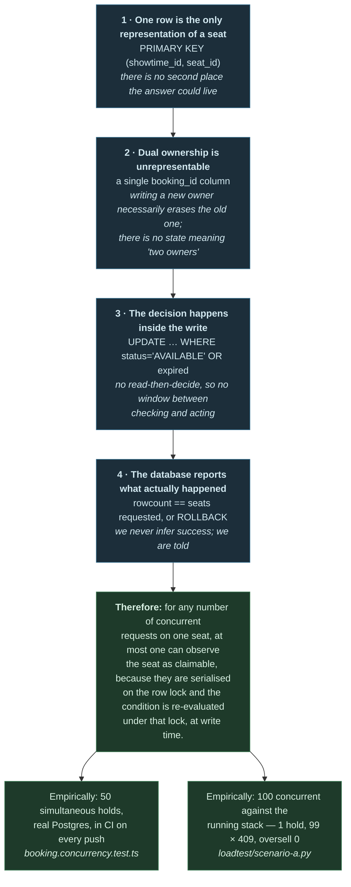

**The caveat we will state before being asked.** This argument covers the
*seat*. The *money* is a separate guarantee, proved the same way: recording a
gateway callback and applying its effect are one transaction
([§7](#7-callback-handling)), so a rollback undoes both together — a
regression test forces the failure that used to break this (a crash between
recording and applying) and asserts it can no longer happen. That was not
always true; it was the single most serious defect we found reviewing our
own code, and it is fixed and tested, not merely documented as a risk. We are
stating it plainly rather than quietly dropping the caveat, because "we found
a real bug and closed it with a regression test" is a stronger claim than
"we never had one."
