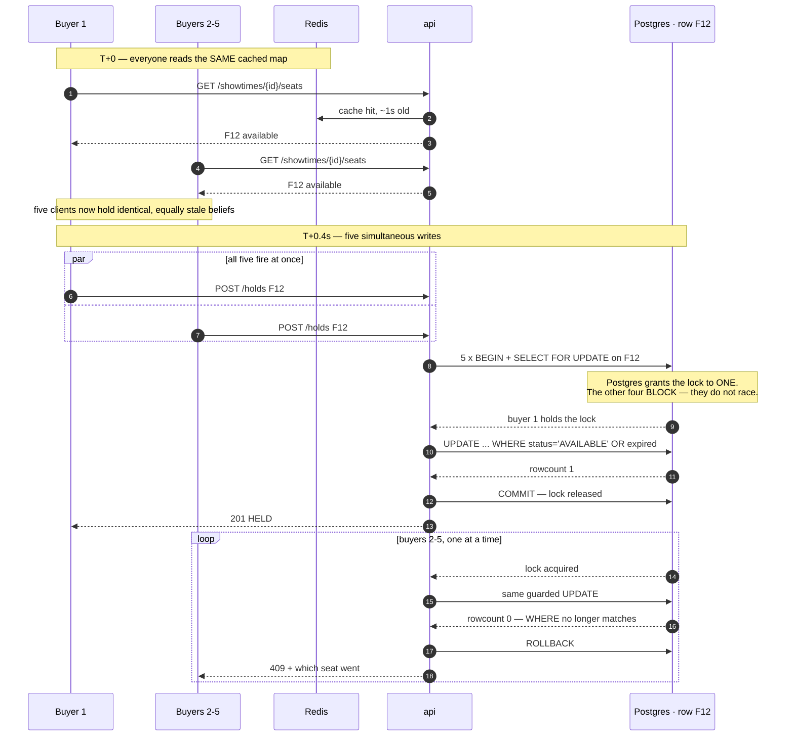

# Edge cases and failure modes

> Companion to [ARCHITECTURE.md](ARCHITECTURE.md). That document says how the
> system is shaped. This one says what happens when things go wrong, and what we
> found when we read the provided gateway's source code instead of trusting its
> documentation.

[A. Five buyers, one available seat](#a-five-buyers-one-available-seat) ·
[B. Monolith or microservices](#b-monolith-or-microservices) ·
[C. What we found in the gateway's source](#c-what-we-found-in-the-gateways-source) ·
[D. Full edge-case sweep](#d-full-edge-case-sweep) ·
[E. Open gaps](#e-open-gaps)

---

## A. Five buyers, one available seat

**The question:** five people load the seat map, all five see F12 as available,
all five tap it at the same instant. What happens?

**The short answer:** all five *are* correct that it was available — at the
moment they read. We never trust that read. There is no "check if available"
step anywhere in our application code, so there is no window between the check
and the act for anyone to slip through.



### Why the stale read is harmless

The classic bug is **check-then-act**:

```js
// THE BUG WE DO NOT HAVE
const seat = await db.query('SELECT status FROM show_seats WHERE ...');
if (seat.status === 'AVAILABLE') {            // <-- five threads all pass here
  await db.query('UPDATE show_seats SET status = $1 ...');   // <-- five winners
}
```

Between the `SELECT` and the `UPDATE` there is a window, and under a premiere
rush that window is where oversell lives. Our version has no window because the
condition lives *inside* the write:

```sql
UPDATE show_seats SET status='HELD', booking_id=$3, hold_expires_at=...
 WHERE showtime_id=$1 AND seat_id = ANY($2)
   AND (status='AVAILABLE' OR (status='HELD' AND hold_expires_at < now()));
```

The database evaluates the condition and performs the write as one indivisible
operation, under a lock it already holds. `rowcount` reports what actually
happened. **The seat map is advisory. The `WHERE` clause is authoritative.**

### The latency question

Contention is *supposed* to cost latency — a seat is a serial resource, and five
people cannot each be given it in parallel. What matters is that the cost is
bounded and lands in the right place.

| | Serial? | Cost |
|---|---|---|
| Reading the seat map | No | Shared 1s Redis cache — hundreds of pollers collapse to ~1 query/sec |
| HTTP + Express + validation | No | Fully concurrent across replicas |
| **The lock-held critical section** | **Yes** | The only serial part. Two statements, no network calls, no application logic |
| Losers' rollback | No | Zero rows touched — a rollback with nothing to undo |

**Measured on the running stack** with `python loadtest/scenario-a.py <url> N`:

| Concurrent buyers, one seat | Holds | Rejected | Oversell | p50 | p95 | Wall clock |
|---|---|---|---|---|---|---|
| **5** | 1 | 4 | **0** | 285 ms | 310 ms | 317 ms |
| **100** | 1 | 99 | **0** | 1014 ms | 1415 ms | 1560 ms |

Note the shape: 20× the contention costs ~3.6× the p50, not 20×. Most of the
285 ms at N=5 is fixed cost — connection setup and first-request warmup — not
queueing. The serial part is small enough that it only starts to dominate well
above five contenders.

Two design choices keep that number honest:

1. **No network call ever happens inside a transaction.** If we called the
   gateway while holding the row lock, one 2 % gateway timeout would hold F12
   hostage for 30 seconds and every other buyer would queue behind it. That is
   how a 2 % failure rate becomes a 100 % outage.
2. **The critical section is two statements long.** Everything else — computing
   the price, building the response, invalidating the cache — happens outside
   the lock.

### What each loser actually sees

Not a generic error. A `409` naming exactly which seats went:

```jsonc
{ "error": { "code": "CONFLICT",
  "message": "One or more seats are no longer available",
  "details": { "unavailable_seats": [{ "seat_id": "…", "label": "F12", "status": "HELD" }] } } }
```

The UI greys those seats out and refreshes the map. **A 409 is not a failure of
the system — it is the system working.** In a race, somebody has to lose, and
losing quickly with an accurate reason is the best available outcome.

### Related races we handle

| Race | Handled by |
|---|---|
| Two buyers request **overlapping multi-seat sets** (A1+A2 vs A2+A3) | `ORDER BY seat_id` in the `FOR UPDATE` — every transaction takes locks in the same order, so they queue instead of deadlocking |
| A buyer requests 3 seats, wins 2, loses 1 | All-or-nothing: `rowcount != requested` → `ROLLBACK`. No partial holds |
| Buyer B claims a seat **the instant** A's hold expires | The `OR (status='HELD' AND hold_expires_at < now())` branch. B wins it, and A's booking is marked `EXPIRED` **in the same transaction** so the two can never disagree |
| Two `/pay` calls for one booking | `UNIQUE INDEX one_live_payment_per_booking` — the second gets a `23505`, not a race |
| The same duplicate callback hits **two replicas simultaneously** | `payment_events.event_id` is a primary key. Exactly one `INSERT` wins |

---

## B. Monolith or microservices?

**It is a modular monolith.** Say it plainly — the rulebook explicitly says
*"Splitting into services is a choice, not a requirement. If you did not split,
be ready to say why you did not need to."*

`api` and `worker` are **the same image**, built once, sharing one test suite.
They differ only in entrypoint. That is not a service boundary in the
microservice sense — it is one deployable with two runtime roles.

| | What we have |
|---|---|
| Codebases | One |
| Images we build | Two (`app`, `web`) — and `api`/`worker`/`migrate`/`seed` all run the *same* `app` image |
| Deployables | One unit — you cannot ship `worker` without shipping `api` |
| Network calls between our own components | **Zero.** Everything shares one database and one process boundary |
| Module boundaries | Enforced in the source tree: `src/modules/{catalog,booking,payment}`, each with `routes → service → repo → rules` |

### The defence, in one paragraph

> "It is a modular monolith, deliberately. The core invariant — a seat, a
> booking and a payment moving together — has to be atomic. Splitting booking
> from payment would have turned one local transaction into a distributed one,
> so we would have built sagas and compensating actions purely to buy back a
> guarantee Postgres was already giving us for free. Instead we split on the
> **sync/async seam**: `api` is stateless and latency-sensitive, `worker` is
> slow and its failures must never touch the request path. They share an image,
> so that split cost us one entrypoint file. The seams for a future split are
> already drawn at `src/modules/*` — `catalog` is the one we would extract
> first, because it is read-only, has no transactional relationship with
> bookings, and is the part a premiere rush hits hardest."

**Do not apologise for this.** A team that ships a clean monolith they can
explain beats a team that ships six services they cannot.

---

## C. What we found in the gateway's source

We pulled the image and read `/app/server.js` rather than working from the
problem statement alone. Several things it does are **not in the documentation**.

### Undocumented capabilities we can use

| Finding | Evidence | Why it matters |
|---|---|---|
| **`/otp/send` accepts a `callback_url`.** If you pass one, the gateway POSTs you `{event_id, ref, code, type:'OTP'}` once delivered | `server.js:374, 409-412` | The problem statement documents only `{phone, ref}`. This means the OTP **can** be delivered to us programmatically — we do not have to grep container logs |
| **`GET /debug/otp/:ref`** returns the full record, including the code | `server.js:457-461` | A far better demo path than `docker compose logs gateway \| grep <ref>` |
| **Deterministic mode always uses code `123456`** | `server.js:380` | With `X-Mock-Mode: deterministic`, the OTP is fixed. Useful for a scripted demo |
| **`/charge` honours `Idempotency-Key`** | `server.js:266-270` | Comment in the source: *"Teams that send one are protected from double charging on retry. Teams that do not, are not."* |
| **Every callback is HMAC-SHA256 signed** as `X-Signature`, secret defaults to `z2p-2026-secret` | `server.js:72-73, 119` | The bonus list names *"verifying the gateway callback signature"* explicitly |

### Behaviours that constrain us

| Behaviour | Evidence | Consequence for our design |
|---|---|---|
| All state is in-memory `Map`s — *"restarting the container wipes everything, by design"* | `server.js:53-58` | A gateway restart loses every pending payment and every OTP. Our payment reconciler catches this: no callback within `PAYMENT_TIMEOUT_SECONDS` → `FAILED` → seats released |
| Callback delivery times out at **5 s** and retries **8 times** with backoff 1,2,4,8,16,30,30 s | `server.js:45, 141-172` | Our callback handler must answer within 5 s. It does no network I/O at all, precisely for this reason |
| `/otp/verify` returns **404 `OTP_NOT_FOUND`** for an unknown ref | `server.js:422` | Happens if no OTP was sent, or after a gateway restart |
| `/otp/verify` returns **429 `TOO_MANY_ATTEMPTS`** after 5 tries | `server.js:428-430` | Fires *before* our own limit of 10 ever does |
| `/otp/send` **resets the attempt counter** for that ref | `server.js:383-390` | The gateway's brute-force guard is bypassable by resending. **Our per-booking send cap of 8 per 15 min is the real guard**, not theirs |
| OTP delivery is delayed **1–8 s**, and the "lost" decision is made at send time | `server.js:381, 395` | There is no way to distinguish "still coming" from "never coming" for up to 8 s. We never claim delivery is guaranteed |
| `/refund` returns **404** (unknown payment) or **409 `NOT_REFUNDABLE`** | `server.js:350-354` | Both are permanent, not transient |
| In `race` mode the gateway `await`s the callback **before** answering `/charge` | `server.js:322-336` | Handled: the payment row is committed *before* we call `/charge`, and `attachGatewayPaymentId` uses `COALESCE` so the callback's write is never clobbered |
| Warns loudly if `callback_url` is `localhost` | `server.js:91-104` | Ours is `http://api:3000/...` — the compose service name |

---

## D. Full edge-case sweep

### Browse and seat map

| Case | Behaviour |
|---|---|
| Redis is down | Rate limiter **fails open**; seat map falls through to Postgres. Degraded performance, not an outage |
| Gateway is down | Irrelevant — this path never touches it. Verified 13/13 by `loadtest/fault-isolation.sh` |
| Hundreds polling one showtime | Collapse into ~1 query/sec via the shared 1 s cache |
| Map shows a seat that was taken 1 s ago | Deliberate. The click gets a clean 409 |
| Hold expired but sweeper has not run | Map reports it `available` anyway — expiry is evaluated in the query, not by the worker |

### Hold

| Case | Behaviour |
|---|---|
| Seat ID not in this showtime | `404`, listing exactly which IDs are wrong |
| Duplicate seat IDs in one request | Deduped by zod schema before the query |
| Zero seats requested | `422` from schema validation |
| Worker container stopped | Holds still expire — lazy evaluation in the `WHERE` clause |
| API replica dies mid-transaction | Postgres rolls back on connection loss. The seat was never taken |
| `HOLD_TTL_SECONDS` set to `5` by a judge | Read from env, no hardcoded fallback in business logic |

### OTP

| Case | Behaviour | Status |
|---|---|---|
| Gateway drops the code (10 %) | User resends, capped at 8 per booking per 15 min | ✅ |
| Wrong code entered | Gateway `400` → our `400 OTP_INVALID` | ✅ |
| Verifying an already-verified booking | Idempotent early return | ✅ |
| OTP requested for a booking that is not `HELD` | `409` before any gateway call | ✅ |
| Gateway container down | `503 GATEWAY_UNAVAILABLE`, never a `500` | ✅ |
| **No OTP was ever sent for this ref** | Gateway `404` → we throw `GatewayUnavailable` → user sees **`503`** | ⚠️ misleading |
| **6th verify attempt** | Gateway `429` → we throw `GatewayUnavailable` → user sees **`503`** | ⚠️ misleading |
| **Gateway restarted mid-flow** | OTP state wiped → `404` → **`503`** | ⚠️ misleading |

### Pay and callback

| Case | Behaviour |
|---|---|
| Pay before OTP verified | `409 OTP_REQUIRED` |
| Pay after the hold expired | `409`, status `EXPIRED` |
| Two `/pay` calls at once | Unique partial index → `23505` → `409` |
| `/charge` returns 500 (2 %) | Retried up to 3× with backoff, then `503` and seats released immediately |
| `/charge` times out | Same path — we do not pin seats waiting for the timeout sweeper |
| Callback arrives before `/charge` returns (`race`) | Payment row committed first; matched by `booking_ref` |
| Same callback twice (8 %) | `event_id` primary key → second is a no-op, still `200` |
| Callback never arrives | Reconciler fails the payment after `PAYMENT_TIMEOUT_SECONDS`, releases seats |
| Late `SUCCEEDED` after we gave up | `REFUND` — we must not resurrect a booking whose seats someone else may now hold |
| Late `FAILED` after `SUCCEEDED` | `IGNORE` — never revoke a paid ticket |
| Unparseable callback body | `200` with `applied: false`. A non-200 would trigger 8 retries |
| Callback for an unknown `booking_ref` | Recorded in the ledger, `200`, no action |

### Infrastructure

| Case | Behaviour |
|---|---|
| Deploy serves a stale image | `deploy.sh` and CI both compare `/health`'s reported SHA against the built SHA and **fail** |
| Postgres exposed to the internet | Published as `127.0.0.1:55432:5432` — Docker's iptables rules run before ufw's, so a bare mapping would have published it |
| `t2.micro` chosen | Will not fit seven containers. `t3.small` minimum, documented |
| Rate limiter blocks Scenario A | `RATE_LIMIT_MAX=2000` — 100 concurrent holds from one IP must not be throttled by us |
| Gateway rate-limited by us | Callback route is mounted **ahead** of the limiter. A 429 is a non-200, which would cause *more* traffic, not less |

---

## E. Open gaps — status

Found by reading the gateway source. **4 of 5 are now fixed**, verified by
61 passing tests (up from 42). [ARCHITECTURE.md §15](ARCHITECTURE.md#15-where-it-breaks)
is the authoritative, complete list — it also covers 20 more findings that
came from reviewing our *own* code, not just the gateway's.

### 1. ✅ Fixed — `X-Signature` is now verified

The gateway HMAC-SHA256 signs every callback with `GATEWAY_SECRET`
(`server.js:72-73, 119`). We now recompute the HMAC over the exact raw request
bytes and check it with `timingSafeEqual` before parsing the body. A missing
or invalid signature still gets `200` (`applied: false`) — a 401 would trigger
the gateway's 8× retry storm.

### 2. ✅ Fixed — `Idempotency-Key` sent on every `/charge`, callbacks matched by `gateway_payment_id`

Both halves of this one are closed. `/charge` now sends
`Idempotency-Key: charge:<booking_ref>`, stable across retries, so a retry the
gateway did receive can't become a second charge. Independently, callback
matching now prefers an exact `gateway_payment_id` when one is attached,
falling back to `booking_ref` only for the documented `race` mode (where the
id genuinely isn't attached yet) — so a callback can no longer be misapplied
to the wrong payment attempt on the same booking.

### 3. OTP error mapping still collapses three cases into `503`

`verifyOtp` treats only `400` as "wrong code" and throws `GatewayUnavailable`
for everything else. So `404 OTP_NOT_FOUND` and `429 TOO_MANY_ATTEMPTS` both
still surface as *"Payment provider is unavailable"*. Left open — lower
severity than the payment-correctness issues above, and confined to error
message clarity during a demo, not a correctness gap.

### 4. Documentation error: the OTP *can* be delivered to us

Still open. [README.md](../README.md#getting-your-otp) and the `hint` in
`payment.routes.ts` both say *"There is no channel that delivers them to us."*
Reading the source shows two: the undocumented `callback_url` on
`/otp/send`, and `GET /debug/otp/:ref`.

### 5. ✅ Fixed — refunds now have a terminal state

A permanent gateway rejection (404 unknown payment, 409 `NOT_REFUNDABLE`) or
`MAX_REFUND_ATTEMPTS` (5) transient failures now moves the payment to
`REFUND_FAILED` instead of retrying every 10s forever.

### Already documented in the README

Per-process circuit breaker (half-open now admits exactly one probe) · fixed-window rate limiting · forward-only
migrations · no authentication · no distributed tracing · 2 s seat-map
staleness · `lib/queue.ts` deleted (refunds run off a database poll, which is
a transactional outbox and was always more durable than the queue).
